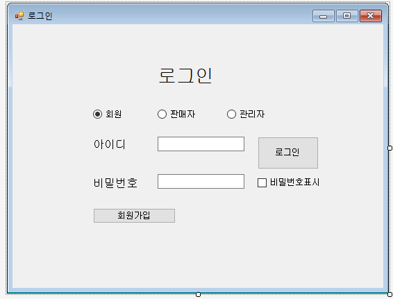

### ```오프라인 회원제 공산품 마트 데이터베이스 및 응용 프로그램 구현하기 ``` 


로그인 창 초기화면


우선 회원, 판매자, 관리자가 각자의 로그인창을 radio로 구별하여 로그인 성공시 각자의 화면으로 갈 수있게 끔 구별하였다.   

```ㅇㄴㅁㄴㅇㅇㄴㅁㅋㄴㅋ₩`ㅋㅁㅃㄴㅋㄴㅃㅋㄴㅃㅁㅇ```

로그인 버튼 코드
```c#

        private void button1_Click(object sender, EventArgs e)
        {
            if (회원버튼.Checked == false && 판매자버튼.Checked == false && 관리자버튼.Checked == false)
            {
                MessageBox.Show("회원타입을 체크해주세요.");
                return;
            }

            if (회원버튼.Checked)
            {
                          

                회원TableAdapter1.Fill(dataSet11.회원);
                mytable = dataSet11.Tables["회원"];

                회원화면.loginid = textBox1.Text;
                마이페이지.loginid = textBox1.Text;
                구입선택.loginid = textBox1.Text;
                후기작성.loginid = textBox1.Text;

                DataRow dataRow = mytable.Rows.Find(textBox1.Text);

                if (dataRow != null && dataRow["회원비밀번호"].ToString() == textBox2.Text)
                {
                    MessageBox.Show("환영합니다 " + dataRow["회원이름"].ToString()+"님!");
                    this.Visible = false;             // 추가
                    회원화면 showForm = new 회원화면();
                    showForm.ShowDialog();
                }
                else if (this.textBox1.Text == string.Empty)
                    MessageBox.Show("아이디를 입력하세요.");
                else if (this.textBox2.Text == string.Empty)
                    MessageBox.Show("비밀번호를 입력하세요");
                else
                    MessageBox.Show("회원정보가 일치하지 않습니다");
            } else if (판매자버튼.Checked)
            {
                
              
                판매자TableAdapter1.Fill(dataSet11.판매자);
                mytable2 = dataSet11.Tables["판매자"];


                DataRow dataRow2 = mytable2.Rows.Find(textBox1.Text);

                if (dataRow2 != null && dataRow2["판매자비밀번호"].ToString() == textBox2.Text )
                {
           
                    판매자화면.판매자매장 = dataRow2["매장ID"].ToString();
                    판매자화면.판매자ID = dataRow2["판매담당자ID"].ToString();
                    승인목록.판매자매장 = dataRow2["매장ID"].ToString();
                    MessageBox.Show(dataRow2["매장ID"].ToString()+"매장 판매 담당자님 환영합니다");
                    this.Visible = false;             // 추가
                    판매자화면 showForm = new 판매자화면();


                    showForm.ShowDialog();
                }
                else if (this.textBox1.Text == string.Empty)
                    MessageBox.Show("아이디를 입력하세요");
                else if (this.textBox2.Text == string.Empty)
                    MessageBox.Show("비밀번호를 입력하세요");
                else
                    MessageBox.Show("판매자정보가 일치하지 않습니다");

            }
            else if (관리자버튼.Checked)
            {
                관리자TableAdapter1.Fill(dataSet11.관리자);
                mytable3 = dataSet11.Tables["관리자"];


                DataRow dataRow3 = mytable3.Rows.Find(textBox1.Text);

                if (dataRow3 != null && dataRow3["관리자비밀번호"].ToString() == textBox2.Text)
                {
                    MessageBox.Show("관리자님 환영합니다");
                    this.Visible = false;             // 추가
                    관리자화면 showForm = new 관리자화면();
                    showForm.ShowDialog();
                }
                else if (this.textBox1.Text == string.Empty)
                    MessageBox.Show("아이디를 입력하세요");
                else if (this.textBox2.Text == string.Empty)
                    MessageBox.Show("비밀번호를 입력하세요");
                else
                    MessageBox.Show("관리자정보가 일치하지 않습니다");
            }

        }
```

```C#

```