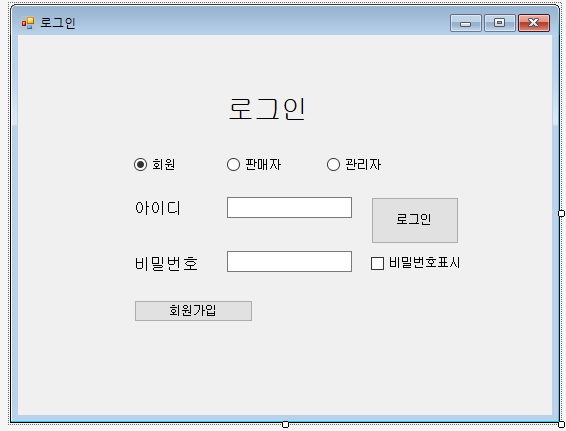

### ```오프라인 회원제 공산품 마트 데이터베이스 및 응용 프로그램 구현하기 ``` 


## 로그인 창 초기화면


우선 회원, 판매자, 관리자가 각자의 로그인창을 radio로 구별하여 로그인 성공시 각자의 화면으로 갈 수있게 끔 구별하였다. 

  ```예를 들자면 회원의 아이디, 비밀번호로 판매자나 관리자의 화면으로 로그인 되지 않게끔 해당 체크된(회원, 판매자, 관리자) radio에 따라 로그인이 되도록 코드를 짯다.``` 


처음에 radio가 아무 타입으로 체크되있지 않는 상태에서 로그인버튼을 누를시 타입을 체크를 부탁하는 메세지를 띄우는 식으로 진행하였으나, 
  ```c#
  //button1_Click은 로그인 버튼의 클릭 이벤트
  //textBox1은 아이디 입력 텍스트박스
  //textBox2는 비밀번호 입력 텍스트박스
   private void button1_Click(object sender, EventArgs e)
        {
            if (회원버튼.Checked == false && 판매자버튼.Checked == false && 관리자버튼.Checked == false)
            {
                MessageBox.Show("로그인할 타입을 체크해주세요.");
                return;
            }
```

번거롭지 않게 radio가 회원 부분에 미리 체크가 되어있는 상태로 로그인 창이 뜨게끔 해당 코드를 작성하였다. 
```c#
        private void 회원체크(object sender, EventArgs e)
        {
            this.button2.Visible = true;
        }
        private void 판매자체크(object sender, EventArgs e)
        {
                this.button2.Visible = false;
     
        }
        private void 관리자체크(object sender, EventArgs e)
        {
            this.button2.Visible = false;
        }
```


최종완성된 로그인 버튼 코드
```c#
        private void button1_Click(object sender, EventArgs e)
        {

            if (회원버튼.Checked)
            {

                회원TableAdapter1.Fill(dataSet11.회원);
                mytable = dataSet11.Tables["회원"];

                회원화면.loginid = textBox1.Text;
                마이페이지.loginid = textBox1.Text;
                구입선택.loginid = textBox1.Text;
                후기작성.loginid = textBox1.Text;
                //로그인이 성공하였을 때 해당 로그인된 회원의 화면으로 접속하여야 하기 때문에 로그인된 회원의 (로그인 textbox에 작성된) 아이디의 정보를 접속 후 들어갈 모든 회원화면에 전송하도록 하였다

                DataRow dataRow = mytable.Rows.Find(textBox1.Text);

                if (dataRow != null && dataRow["회원비밀번호"].ToString() == textBox2.Text)
                {
                    MessageBox.Show("환영합니다 " + dataRow["회원이름"].ToString()+"님!");
                    this.Visible = false;             // 추가
                    회원화면 showForm = new 회원화면();
                    showForm.ShowDialog();
                }
                else if (this.textBox1.Text == string.Empty)
                    MessageBox.Show("아이디를 입력하세요.");
                else if (this.textBox2.Text == string.Empty)
                    MessageBox.Show("비밀번호를 입력하세요");
                else
                    MessageBox.Show("회원정보가 일치하지 않습니다");
            } else if (판매자버튼.Checked)
            {
                
              
                판매자TableAdapter1.Fill(dataSet11.판매자);
                mytable2 = dataSet11.Tables["판매자"];


                DataRow dataRow2 = mytable2.Rows.Find(textBox1.Text);

                if (dataRow2 != null && dataRow2["판매자비밀번호"].ToString() == textBox2.Text )
                {
           
                    판매자화면.판매자매장 = dataRow2["매장ID"].ToString();
                    판매자화면.판매자ID = dataRow2["판매담당자ID"].ToString();
                    승인목록.판매자매장 = dataRow2["매장ID"].ToString();
                    MessageBox.Show(dataRow2["매장ID"].ToString()+"매장 판매 담당자님 환영합니다");
                    this.Visible = false;             // 추가
                    판매자화면 showForm = new 판매자화면();


                    showForm.ShowDialog();
                }
                else if (this.textBox1.Text == string.Empty)
                    MessageBox.Show("아이디를 입력하세요");
                else if (this.textBox2.Text == string.Empty)
                    MessageBox.Show("비밀번호를 입력하세요");
                else
                    MessageBox.Show("판매자정보가 일치하지 않습니다");

            }
            else if (관리자버튼.Checked)
            {
                관리자TableAdapter1.Fill(dataSet11.관리자);
                mytable3 = dataSet11.Tables["관리자"];


                DataRow dataRow3 = mytable3.Rows.Find(textBox1.Text);

                if (dataRow3 != null && dataRow3["관리자비밀번호"].ToString() == textBox2.Text)
                {
                    MessageBox.Show("관리자님 환영합니다");
                    this.Visible = false;             // 추가
                    관리자화면 showForm = new 관리자화면();
                    showForm.ShowDialog();
                }
                else if (this.textBox1.Text == string.Empty)
                    MessageBox.Show("아이디를 입력하세요");
                else if (this.textBox2.Text == string.Empty)
                    MessageBox.Show("비밀번호를 입력하세요");
                else
                    MessageBox.Show("관리자정보가 일치하지 않습니다");
            }

        }
```

추가적으로 비밀번호를 입력할시 보안을 위해 *** 의 형태로 보이지 않게끔 작성되도록 하였고 사용자가 입력한 비밀번호의 내용을 보고싶을 때 비밀번호 표시 체크박스를 체크하여 볼 수 있도록 하였다

```C#
        private void checkBox1_CheckedChanged(object sender, EventArgs e)
        {
           if(checkBox1.Checked == true)
            {
                textBox2.PasswordChar = default(char);
            }
            else
            {
                textBox2.PasswordChar = '*';
            }
        }
```

## 회원가입 초기화면

회원가입시 기본적으로 필요한 회원의 정보들을 입력하도록 UI를 만들고 내용을 입력하지 않은 상태에서 회원가입 버튼을 누를시 입력해달라는 메세지가 뜨게끔 하였다
```C#
           if (this.textBox1.Text == string.Empty)
            {
                MessageBox.Show("이름을 입력해주세요!");
                return;  //종료 - 메서드를 종료
            }
            mynewDataRow["회원ID"] = textBox2.Text;
            if (this.textBox2.Text == string.Empty)
            {
                MessageBox.Show("아이디를 입력해주세요!");
                return;  //종료 - 메서드를 종료

            }
            mynewDataRow["회원비밀번호"] = textBox3.Text;
            if (this.textBox3.Text == string.Empty)
            {
                MessageBox.Show("비밀번호를 입력해주세요!");
                return;  //종료 - 메서드를 종료

            }
            if (this.textBox7.Text == string.Empty)
            {
                MessageBox.Show("비밀번호확인을 입력해주세요!");
                return; //종료 - 메서드를 종료

            }
            mynewDataRow["회원전화번호"] = textBox4.Text;
            if (this.textBox4.Text == string.Empty)
            {
                MessageBox.Show("전화번호를 입력해주세요!");
                return;  //종료 - 메서드를 종료

            }
            mynewDataRow["회원이메일"] = textBox5.Text;
            if (this.textBox5.Text == string.Empty)
            {
                MessageBox.Show("이메일을 입력해주세요!");
                return;  //종료 - 메서드를 종료

            }

            if (중복체크 == false)
            {
                MessageBox.Show("아이디 중복체크를 해주세요!");
                return;
            }
            else if (중복체크확인 == false){
                MessageBox.Show("중복된 아이디로 사용하실 수 없습니다");
                return;
            }
```


추가적으로 회원이 로그인 할 때 비밀번호를 실수로 잘못입력하여 기억하지 못할 수있는 점을 생각하여 비밀번호확인이라는 텍스트박스를 만들고 가입할 비밀번호를 두번 입력하게 하여 입력한 두 내용이 일치하여야 가입이 되게끔 하였다
```C#
       if (textBox7.Text != textBox3.Text) //비밀번호 textbox와 비밀번호확 textbox의 내요이 일치하지 않을 시
            {
                MessageBox.Show("비밀번호 확인이 일치하지 않습니다");
                return;  //종료 - 메서드를 종료
            }
```

+ 중복체크 부분 미작성  . . ( 선언한 변수들 . . . )

+ 회원가입이 완료되었을 때 이루어지는 동작들 . . 