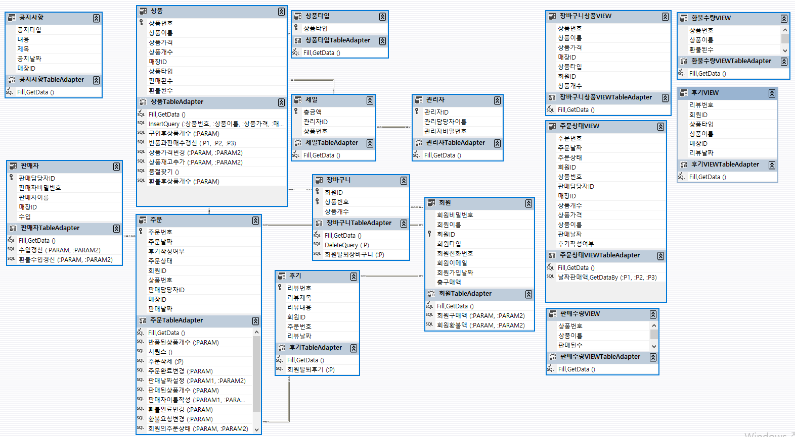

## 사용한 쿼리들

  


### 상품
InsertQuery(:상품번호,:상품이름,:상품가격,:매장ID,:상품타입,:상품개수) - INSERT   
``` sql
INSERT INTO "SS5532991"."상품" ("상품번호", "상품이름", "상품가격", "매장ID", "상품타입", "상품개수") 
VALUES (:상품번호, :상품이름, :상품가격, :매장ID, :상품타입, :상품개수)
```

구입후상품개수(:PARAM) - UPDATE  
``` sql
UPDATE 상품
SET 상품개수 = 상품개수-1
WHERE 상품번호 = :PARAM
```

반품과판매수갱신(:P1,:P2,P3) - UPDATE 
``` sql
UPDATE 상품
SET 판매된수 = :P1 , 환불된수 = :P2
WHERE 상품번호 = :P3
```

상품가격변경(:PARAM,:PARAM2) - UPDATE 
``` sql
UPDATE 상품
SET 상품가격 = :PARAM
WHERE 상품번호 = :PARAM2
```

상품재고추가(:PARAM,:PARAM2) - UPDATE   
``` sql
UPDATE 상품
SET 상품개수 = 상품개수 + :PARAM
WHERE 상품번호 = :PARAM2
```

품절찾기() - 단일 값 SELECT
``` sql
UPDATE 상품
SET 상품개수 = 상품개수 + :PARAM
WHERE 상품번호 = :PARAM2
```

환불후상품개수(:PARAM) - UPDATE  
``` sql
UPDATE 상품
SET 상품개수=상품개수+1
WHERE 상품번호 = :PARAM
```

### 장바구니
DeleteQuery(:P) - DELETE  
``` sql
DELETE 
FROM 장바구니
WHERE 상품번호 = :P
```

회원탈퇴장바구니(:P) - DELETE  
``` sql
DELETE FROM 장바구니
WHERE 회원ID = :P
```

### 회원
회원구매액(:PARAM,:PARAM2) - UPDATE  
``` sql
UPDATE 회원
SET 총구매액 = 총구매액 + :PARAM
WHERE 회원ID = :PARAM2
``` 

회원환불액(:PARAM,:PARAM2) - UPDATE  
``` sql
UPDATE 회원
SET 총구매액 = 총구매액 - :PARAM
WHERE 회원ID = :PARAM2
```

### 후기
회원탈퇴후기(:P) - UPDATE  
``` sql
UPDATE 후기
SET 회원ID = '탈퇴한회원'
WHERE 회원ID = :P
```

### 주문
반품된상품개수(:PARAM) - 단일 값 SELECT  
``` sql
SELECT COUNT(*) 
FROM 주문
WHERE 상품번호 = :PARAM AND 주문상태 = '환불완료'
```

시퀀스() - 단일 값 SELECT  
``` sql
SELECT 주문시퀀스.nextval
FROM DUAL
```

주문삭제(:P) - DELETE  
``` sql
DELETE FROM 주문
WHERE 주문번호 = :P
```

주문완료변경(:PARAM) - UPDATE  
``` sql
UPDATE 주문
SET 주문상태 = '주문완료'
WHERE 주문번호 = :PARAM
```

판매날짜설정(:PARAM1,:PARAM2) - UPDATE  
``` sql
UPDATE 주문
SET 판매날짜 = :PARAM1
WHERE 주문번호 = :PARAM2
```
판매된상품개수(:PARAM) - 단일 값 SELECT  
``` sql
SELECT COUNT(*) 
FROM 주문
WHERE 상품번호 = :PARAM AND 주문상태 = '주문완료'
```

판매자이름작성(:PARAM1,:PARAM2) - UPDATE  
``` sql
UPDATE 주문
SET 판매담당자ID = :PARAM1
WHERE 주문번호 = :PARAM2
```

환불완료변경(:PARAM) - UPDATE  
``` sql
UPDATE 주문
SET 주문상태 = '환불완료'
WHERE 주문번호 = :PARAM
```

환불요청변경(:PARAM) - UPDATE  
``` sql
UPDATE 주문
SET 주문상태 = '환불요청'
WHERE 주문번호 = :PARAM
```

회원의주문상태(:PARAM,:PARAM2) - 단일 값 SELECT  
``` sql
SELECT COUNT(*) 
FROM 주문 
WHERE 회원ID = :PARAM AND 주문상태 = :PARAM2
```

회원탈퇴주문(:P) - UPDATE  
``` sql
UPDATE 주문
SET 회원ID = '탈퇴한회원'
WHERE 회원ID = :P
```

후기작성여부(:PARAM) - UPDATE  
``` sql
UPDATE 주문
SET 후기작성여부 = '후기작성'
WHERE 주문번호 = :PARAM
```

### 판매자
수입갱신(:PARAM,:PARAM2) - UPDATE  
``` sql
UPDATE 판매자
SET 수입 = 수입 + :PARAM
WHERE 판매담당자ID = :PARAM2
```

환불수입갱신(:PARAM,:PARAM2) - UPDATE  
``` sql
UPDATE 판매자
SET 수입 = 수입 - :PARAM
WHERE 판매담당자ID = :PARAM2
```

### 주문상태VIEW
날짜판매액,GetDataBy(:P1,:P2,:P3) - 행 SELECT 
``` sql
SELECT 주문번호, 상품가격, 후기작성여부 
FROM SS5532991.주문상태VIEW 
WHERE (주문상태 = '주문완료') AND (매장ID = :P1) AND (to_char(trunc(판매날짜), 'yyyy-mm-dd') BETWEEN :P2 AND :P3)
```
