구현을 하면서 폼의 디자인 부분도 신경을 썻다
우선 metro를 이용하여 좀더 깔끔한 UI 디자인으로 변경하여 틀을 잡았다.
metro를 사용하기 위해서 구글에 검색을 해 깔고 (무엇을 어떤경로로 깔았는지?)

### Metro 디자인 적용 전 기본적인 UI
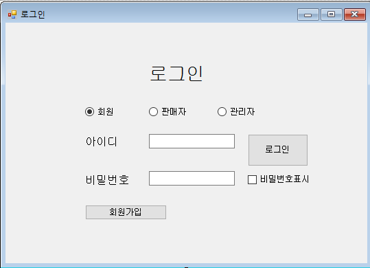  


### Metro 적용법
```도구(T) -> NuGet 패키지 관리자(N) -> 솔루션용 NuGet``` 패키지 관리를 클릭하면 아래의 사진 화면이 나오는데 여기서 ```MetroModernUI```를 검색하고 설치한다.
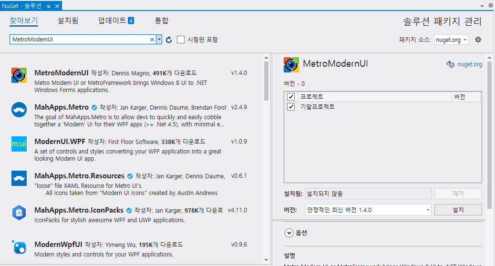  
설치를 완료하면 아래 두 장의 사진처럼 솔루션 탐색기와 도구상자에 Metro와 관련된 요소들이 추가된 것을 확인할 수 있다.  
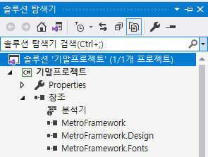  
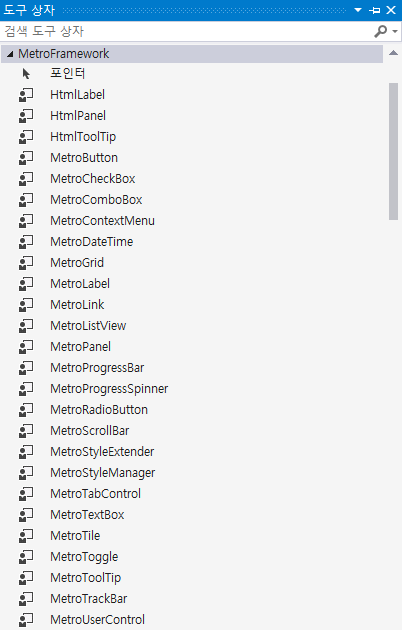

### metro 적용하기 위해 변경/추가된 코드
그런 다음 헤더 코드 밑에 ```using MetroFramework.Forms;``` 를 추가해주고  
기존 프로젝트의 코드 ```public partial class form : Form``` 에서 ```public partial class form : MetroForm``` 으로 수정해주면 아래의 사진처럼 폼이 Metro 디자인으로 변경된다
```C#
using System;
using System.Collections.Generic;
using System.ComponentModel;
using System.Data;
using System.Drawing;
using System.Linq;
using System.Text;
using System.Threading.Tasks;
using System.Windows.Forms;
using MetroFramework.Forms; //추가!

namespace 프로젝트
{
    public partial class form : MetroForm // form에서 MetroForm으로 변경!
    {
      //  . . . 생략

    }
}
```
### Metro 디자인 적용 후 기본적인 UI
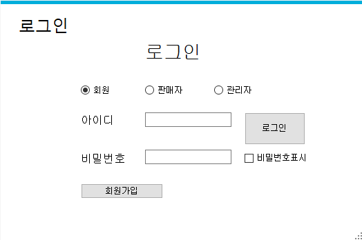 


### 추가적으로 판넬과 이미지들을 넣고 버튼의 디테일한 디자인들을 입혀 전체적인 컨셉을 구축했다  
PictureBox 속성
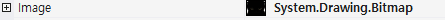  
버튼의 속성들  
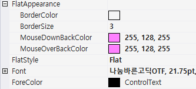  
버튼의 속성 
- BackColor - 버튼의 배경색을 설장할 수 있다  
- FlatStyle - 버튼의 스타일을 설장할 수 있다  
- Font - 버튼의 텍스트의 폰트를 설정할 수 있다  

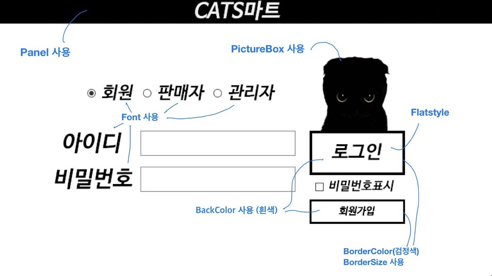
- FlatAppearance에 
  - BorderColor - 버튼의 테두리 색깔을 설정할 수 있다
  - BorderSize - 버튼의 테두리 굵기를 설정할 수 있다
  - MouseDownBackColor - 버튼을 클릭할 때 변경될 배경색을 설정할 수 있다
  - MouseOverBackColor - 버튼 위에 마우스를 올려놓았을 때 변경될 배경색을 설정할 수 있다 

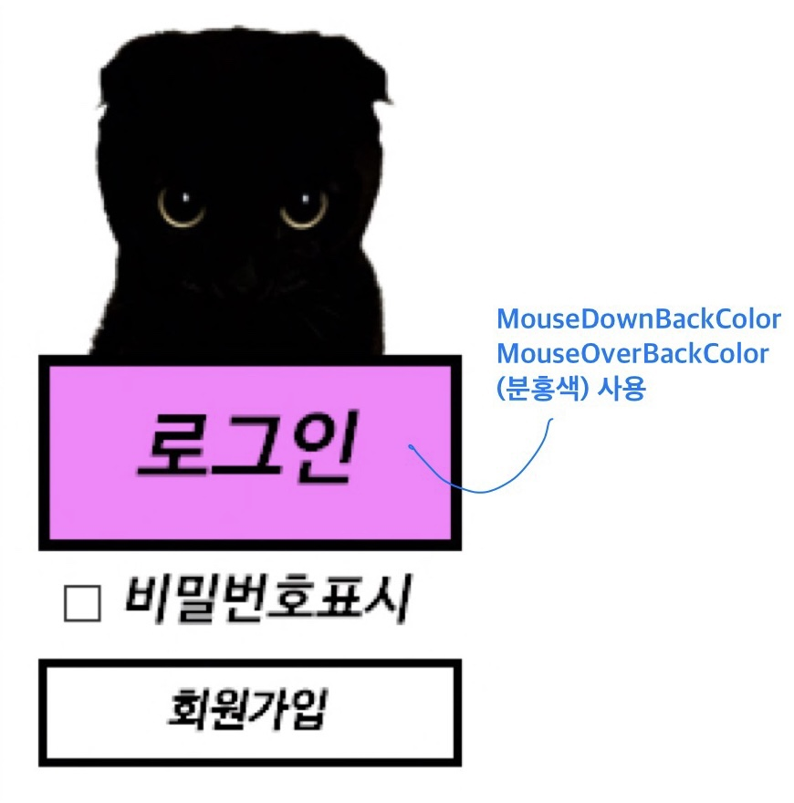

### 구입선택 폼에서는 매장을 바꿀때마다 아래 그림의 매장텍스트와  FontColor, 버튼의 BorderColor가 바뀌도록 코드를 짜서 디테일도 추가했다
A매장일 때 폰트와 버튼 테두리 색(빨강)
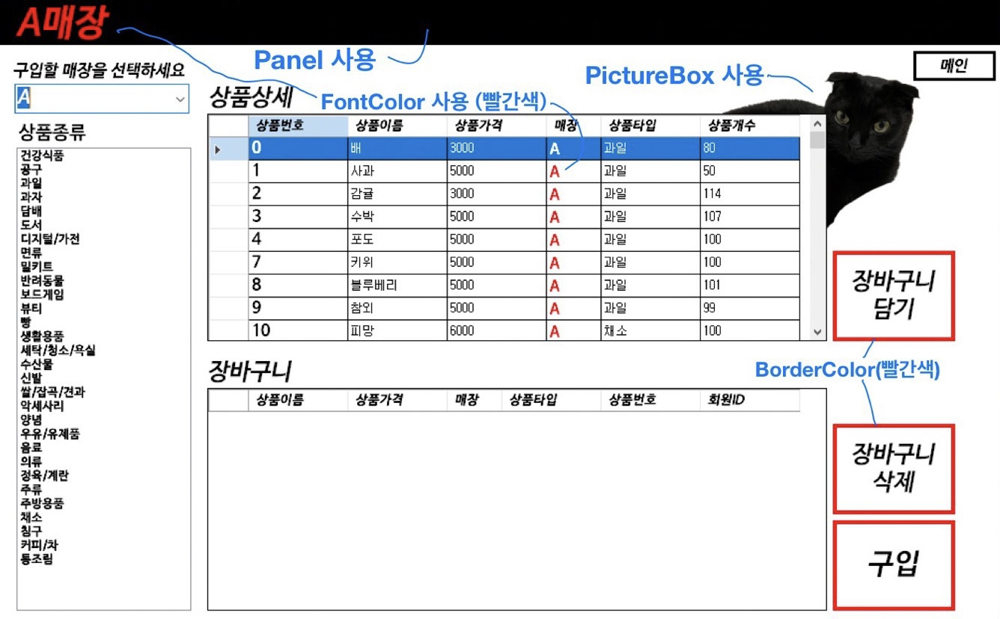
A매장일 때 폰트와 버튼 테두리 색(파랑)
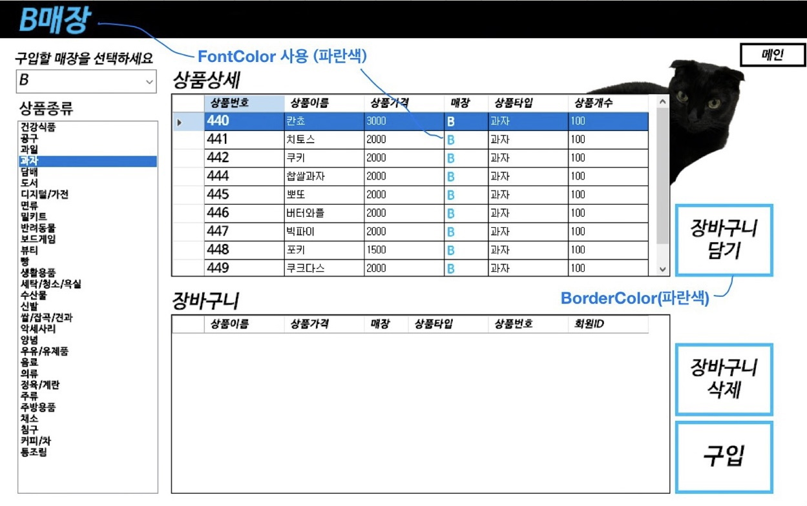

### 해당 코드
```C#
   private void comboBox1_SelectedIndexChanged(object sender, EventArgs e) //구입매장선택을 바꿀때의 이벤트 함수
        {
            상품타입TableAdapter1.Fill(dataSet11.상품타입);
            mytable = dataSet11.Tables["상품타입"];

            상품TableAdapter1.Fill(dataSet11.상품);
            mytable2 = dataSet11.Tables["상품"];
            
            if (comboBox1.SelectedIndex == 0) //A매장일 떄 빨간색
            {
                매장.Text = "A매장";
                매장.ForeColor = Color.Red; //매장의 폰트색변경
                button3.FlatAppearance.BorderColor = Color.Red;
                button4.FlatAppearance.BorderColor = Color.Red;
                button5.FlatAppearance.BorderColor = Color.Red; //버튼들의 BorderColor변경
                dataGridView1.Columns[3].DefaultCellStyle.ForeColor = Color.Red; 
                dataGridView2.Columns[2].DefaultCellStyle.ForeColor = Color.Red; //그리드뷰의 매장 FontColor변경
                상품BindingSource.Filter = "매장ID= 'A'";
                장바구니상품VIEWBindingSource.Filter = "회원ID= '" + loginid + "' AND 매장ID= 'A'";
            }
            else if (comboBox1.SelectedIndex == 1) //B매장일 때 파란색
            {
                매장.Text = "B매장";
                매장.ForeColor = Color.DeepSkyBlue;
                button3.FlatAppearance.BorderColor = Color.DeepSkyBlue;
                button4.FlatAppearance.BorderColor = Color.DeepSkyBlue;
                button5.FlatAppearance.BorderColor = Color.DeepSkyBlue;
                dataGridView1.Columns[3].DefaultCellStyle.ForeColor = Color.DeepSkyBlue;
                dataGridView2.Columns[2].DefaultCellStyle.ForeColor = Color.DeepSkyBlue;
                상품BindingSource.Filter = "매장ID= 'B'";
                장바구니상품VIEWBindingSource.Filter = "회원ID= '" + loginid + "' AND 매장ID= 'B'";
            }
            else if (comboBox1.SelectedIndex == 2)
            {
                //앞의 코드와 색을 제외하고 동일 (노란색)  
            }
            else if (comboBox1.SelectedIndex == 3)
            {
               //앞의 코드와 색을 제외하고 동일 (초록색)
            }
            else
            {
                //앞의 코드와 색을 제외하고 동일 (갈색)
            }
        }
```

+리스트뷰 색깔 디자인 부분
