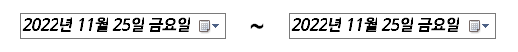

+전역변수들, 자세한코드(이벤트코드,수치코드) 등등 추가 해야함

## 관리자로 로그인
radio를 관리자로 체크한 다음 로그인시도를하면 관리자화면으로  로그인 할 수있다.   


## 관리자로그인 후 관리자메뉴
관리자가 로그인을 하고 할 수있는 기능들을 여섯가지로 나누어 버튼을 만들었다

## 판매액현황
특정 기간동안 각 마트의 수입이 어느정되 되는지 숫자와 수치로 볼 수있도록 하였다


아래의 달력을 "언제부터 ~ 언제까지" 날짜 설정을 하면 해당기간 동안의 각마트마다 판매액을 숫자와 수치로 알 수있다


아래는 기간을 11/1 ~ 11/30로 11월 한 달의 각 마트의 총 판매액을 나타낸 것이다


날짜를 변경할 때 변경될 판매액 코드
``` C#

        private void 날짜변경(object sender, EventArgs e)
        {

            if (dateTimePicker1.Value <= dateTimePicker2.Value)
            {

                string day = dateTimePicker1.Value.ToString("yyyy-MM-dd");
                string day2 = dateTimePicker2.Value.ToString("yyyy-MM-dd");

                주문상태VIEWTableAdapter1.날짜판매액(dataSet11.주문상태VIEW,"A", day, day2);
                주문상태VIEWTableAdapter1.날짜판매액(dataSet12.주문상태VIEW, "B", day, day2);
                주문상태VIEWTableAdapter1.날짜판매액(dataSet13.주문상태VIEW, "C", day, day2);
                주문상태VIEWTableAdapter1.날짜판매액(dataSet14.주문상태VIEW, "D", day, day2);
                주문상태VIEWTableAdapter1.날짜판매액(dataSet15.주문상태VIEW, "E", day, day2);

                mytableA = dataSet11.Tables["주문상태VIEW"];
                foreach (DataRow mydataRow in mytableA.Rows)
                {
                    판매액A += Convert.ToInt32(mydataRow["상품가격"]);

                }
                mytableB = dataSet12.Tables["주문상태VIEW"];
                foreach (DataRow mydataRow in mytableB.Rows)
                {
                    판매액B += Convert.ToInt32(mydataRow["상품가격"]);

                }
                mytableC = dataSet13.Tables["주문상태VIEW"];
                foreach (DataRow mydataRow in mytableC.Rows)
                {
                    판매액C += Convert.ToInt32(mydataRow["상품가격"]);

                }
                mytableD = dataSet14.Tables["주문상태VIEW"];
                foreach (DataRow mydataRow in mytableD.Rows)
                {
                    판매액D += Convert.ToInt32(mydataRow["상품가격"]);

                }
                mytableE = dataSet15.Tables["주문상태VIEW"];
                foreach (DataRow mydataRow in mytableE.Rows)
                {
                    판매액E += Convert.ToInt32(mydataRow["상품가격"]);

                }


                AtextBox.Text = 판매액A.ToString();
                BtextBox.Text = 판매액B.ToString();
                CtextBox.Text = 판매액C.ToString();
                DtextBox.Text = 판매액D.ToString();
                EtextBox.Text = 판매액E.ToString();
                총textBox.Text = (판매액A + 판매액B + 판매액C + 판매액D +판매액E).ToString();
         
                chart1.Series[0].Points.Clear();
         
                chart1.Series[0].Points.AddXY("A", 판매액A);
                chart1.Series[0].Points.AddXY("B", 판매액B);
                chart1.Series[0].Points.AddXY("C", 판매액C);
                chart1.Series[0].Points.AddXY("D", 판매액D);
                chart1.Series[0].Points.AddXY("E", 판매액E);
                chart1.Series[0].Points.AddXY("총", 판매액A+판매액B+판매액C+판매액D+판매액E);
            
                판매액A = 0;
                판매액B = 0;
                판매액C = 0;
                판매액D = 0;
                판매액E = 0;

            }
            else
            {
                MessageBox.Show("시작날짜가 마지막날짜보다 클 수없습니다");
   
            }
        }
```


## 상품현황
전체 상품에서 판매횟수가 많은 상품 10개, 환불횟수가 많은 상품 10개를 순위별로 정리하며 수치로 볼 수있다 


상품현황 폼을 열었을 때의 코드
``` C#
        private void 상품현황_Load(object sender, EventArgs e)
        {
            상품TableAdapter1.Fill(dataSet11.상품);
            mytable = dataSet11.Tables["상품"];


            foreach (DataRow dataRow in mytable.Rows)
            {
               int 판매된수 =  Convert.ToInt32(주문TableAdapter1.판매된상품개수(dataRow["상품번호"].ToString()));
               int 환불된수 = Convert.ToInt32(주문TableAdapter1.반품된상품개수(dataRow["상품번호"].ToString()));

                상품TableAdapter1.반품과판매수갱신(판매된수, 환불된수, dataRow["상품번호"].ToString());
            }


            판매수량VIEWTableAdapter1.Fill(this.dataSet11.판매수량VIEW);
            환불수량VIEWTableAdapter1.Fill(this.dataSet11.환불수량VIEW);

            listView1.Items.Clear();

            mytable2 = dataSet11.Tables["판매수량VIEW"];
            mytable3 = dataSet11.Tables["환불수량VIEW"];

            foreach (DataRow dataRow1 in mytable2.Rows)
            {
     
                    ListViewItem lvi1 = new ListViewItem(dataRow1["상품이름"].ToString());
                    lvi1.SubItems.Add(dataRow1["상품번호"].ToString());
                lvi1.SubItems.Add(dataRow1["매장ID"].ToString());
                listView1.Items.Add(lvi1);
      
            }
            foreach (DataRow dataRow2 in mytable3.Rows)
            {

                ListViewItem lvi1 = new ListViewItem(dataRow2["상품이름"].ToString());
                lvi1.SubItems.Add(dataRow2["상품번호"].ToString());
                lvi1.SubItems.Add(dataRow2["매장ID"].ToString());
                listView1.Items.Add(lvi1);

            }


        }

```

## 재고현황
현재 상품들의 재고들(판매가능수)이 몇개가 있으며 그 중 판매가 되었다가 다시 반품된 재고들이 몇개가 있는지 상품을 누를 때마다 숫자와 수치로 표현된다


재고현황 폼을 열었을 때 코드
``` C#
       private void 재고현황_Load(object sender, EventArgs e)
        {
            comboBox1.SelectedIndex = 0;

            상품타입listBox.Items.Clear();

            상품타입TableAdapter1.Fill(dataSet11.상품타입);
            mytable = dataSet11.Tables["상품타입"];


            foreach (DataRow mydataRow in mytable.Rows)
            {
                상품타입listBox.Items.Add(mydataRow["상품타입"]);
            }
        }
```

매장 ComboBox의 SelectedIndexChanged 속성이벤트 코드
``` C#
       private void 매장(object sender, EventArgs e)
        {


            상품TableAdapter1.Fill(dataSet11.상품);
            mytable = dataSet11.Tables["상품"];

        


            재고현황listView.Items.Clear();
            상품TableAdapter1.Fill(dataSet11.상품);
            mytable = dataSet11.Tables["상품"];

   
                foreach (DataRow dataRow in mytable.Rows)
                {
                    if (dataRow["매장ID"].ToString() == comboBox1.SelectedItem.ToString() && mytable != null)
                    {
                        ListViewItem lvi1 = new ListViewItem(dataRow["상품번호"].ToString());
                        lvi1.SubItems.Add(dataRow["상품이름"].ToString());
                        lvi1.SubItems.Add(dataRow["매장ID"].ToString());
                        lvi1.SubItems.Add(dataRow["상품개수"].ToString());
                        lvi1.SubItems.Add(주문TableAdapter1.반품된상품개수(dataRow["상품번호"].ToString()).ToString());
                        재고현황listView.Items.Add(lvi1);
                    }
                }


                this.재고현황listView.Items[0].Focused = true;
                this.재고현황listView.Items[0].Selected = true;
            
   
        }
```

상품타입 ListBox의  SelectedIndexChanged 속성이벤트 코드
``` C#
       private void 상품타입(object sender, EventArgs e)
        {

    재고현황listView.Items.Clear();
                상품TableAdapter1.Fill(dataSet11.상품);
                mytable = dataSet11.Tables["상품"];

                foreach (DataRow dataRow in mytable.Rows)
                {

                    if (dataRow["매장ID"].ToString() == comboBox1.SelectedItem.ToString() && dataRow["상품타입"].ToString() == 상품타입listBox.SelectedItem.ToString() && mytable != null)
                    {
                        ListViewItem lvi1 = new ListViewItem(dataRow["상품번호"].ToString());
                        lvi1.SubItems.Add(dataRow["상품이름"].ToString());
                        lvi1.SubItems.Add(dataRow["매장ID"].ToString());
                        lvi1.SubItems.Add(dataRow["상품개수"].ToString());
                        lvi1.SubItems.Add(주문TableAdapter1.반품된상품개수(dataRow["상품번호"].ToString()).ToString());
                        재고현황listView.Items.Add(lvi1);

                    }

                }

        }
```

상품선택 ListView의  SelectedIndexChanged 속성이벤트 코드
``` C#
      private void 상품선택(object sender, EventArgs e)
        {
            if (재고현황listView.SelectedItems.Count > 0)
            {
                chart1.Series[0].Points.Clear();
                chart1.Series[1].Points.Clear();
                int SelectRow = 재고현황listView.SelectedItems[0].Index;
                int 판매된수 = Convert.ToInt32(재고현황listView.Items[SelectRow].SubItems[3].Text);
                int 환불된수 = Convert.ToInt32(재고현황listView.Items[SelectRow].SubItems[4].Text);
                chart1.Series[0].Points.AddXY(" ",판매된수);
                chart1.Series[1].Points.AddXY(" ",환불된수);

            }
        }
```