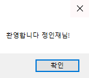
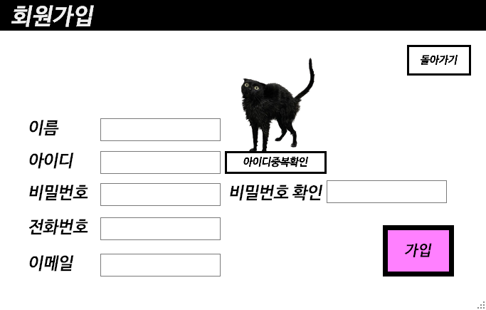
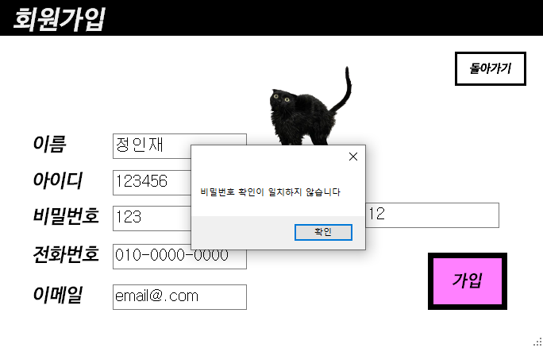
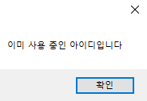
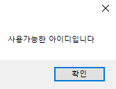
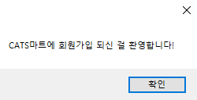

### ```오프라인 회원제 공산품 마트 데이터베이스 및 응용 프로그램 구현하기 ``` 


## 로그인 창 화면


우선 회원, 판매자, 관리자가 각자의 로그인창을 radio로 구별하여 로그인 성공시 각자의 화면으로 갈 수있게 끔 구별하였다. 

  ```예를 들자면 회원의 아이디, 비밀번호로 판매자나 관리자의 화면으로 로그인 되지 않게끔 해당 체크된(회원, 판매자, 관리자) radio에 따라 로그인이 되도록 코드를 짯다.``` 


처음에 radio가 아무 타입으로 체크되있지 않는 상태에서 로그인버튼을 누를시 타입을 체크를 부탁하는 메세지를 띄우는 식으로 진행하였으나, 
  ```c#
  //button1_Click은 로그인 버튼의 클릭 이벤트
  //textBox1은 아이디 입력 텍스트박스
  //textBox2는 비밀번호 입력 텍스트박스
   private void button1_Click(object sender, EventArgs e)
        {
            if (회원버튼.Checked == false && 판매자버튼.Checked == false && 관리자버튼.Checked == false)
            {
                MessageBox.Show("로그인할 타입을 체크해주세요.");
                return;
            }
        }
```

번거롭지 않게 radio가 회원 부분에 미리 체크가 되어있는 상태로 로그인 창이 뜨게끔 해당 코드를 작성하였다. 
```c#
        private void 회원체크(object sender, EventArgs e)
        {
            this.button2.Visible = true;
        }
        private void 판매자체크(object sender, EventArgs e)
        {
                this.button2.Visible = false;
     
        }
        private void 관리자체크(object sender, EventArgs e)
        {
            this.button2.Visible = false;
        }
```

로그인이 성공하고 로그인한 아이디의 정보를 그 다음 창들에게 전송하는 것을 고민했다. 예를 들면 '1번' 회원의 마이페이지, 장바구니와 '2번' 회원의 마이페이지, 장바구니의 내용이 개별적으로 구분되어야 할텐데 그러기 위해서는 로그인을 성공 한 순간 입력했던 아이디 텍스트박스의 내용(회원들을 구분하는 주키)을 다른 폼들에게도 전송해야 하는 것이다.

그러기 위해 아이디 정보를 전송받아야 할 모든 폼들에게 전역으로 변수로 선언해준 다음 
```C#
     public static string loginid;
```
로그인 폼에서 로그인이 성공할 때 아이디 텍스트박스의 내용을 전역변수로 집어넣는 것이다.
```c#
//로그인 성공 시
//textBox1은 아이디 텍스트박스이다           
    회원화면form.loginid = textBox1.Text;  
    마이페이지form.loginid = textBox1.Text;            
    구입선택form.loginid = textBox1.Text;
    후기작성form.loginid = textBox1.Text;
```
로그인 성공시 (추가 설명 필요)  
  
  
최종완성된 로그인 버튼 코드
```c#
        private void button1_Click(object sender, EventArgs e) //로그인 버튼 클릭 시
        {

            if (회원버튼.Checked) //회원 로그인
            {

                회원TableAdapter1.Fill(dataSet11.회원);
                mytable = dataSet11.Tables["회원"];

                회원화면.loginid = textBox1.Text;
                마이페이지.loginid = textBox1.Text;
                구입선택.loginid = textBox1.Text;
                후기작성.loginid = textBox1.Text;
                //로그인이 성공하였을 때 해당 로그인된 회원의 화면으로 접속하여야 하기 때문에 
                //로그인된 회원의 (로그인 textbox에 작성된) 아이디의 정보를 접속 후 들어갈 모든 회원화면에 전송하도록 하였다

                DataRow dataRow = mytable.Rows.Find(textBox1.Text);

                if (dataRow != null && dataRow["회원비밀번호"].ToString() == textBox2.Text)
                {
                    MessageBox.Show("환영합니다 " + dataRow["회원이름"].ToString()+"님!");
                    this.Visible = false;             // 추가
                    회원화면 showForm = new 회원화면();
                    showForm.ShowDialog();
                }
                else if (this.textBox1.Text == string.Empty)
                    MessageBox.Show("아이디를 입력하세요.");
                else if (this.textBox2.Text == string.Empty)
                    MessageBox.Show("비밀번호를 입력하세요");
                else
                    MessageBox.Show("회원정보가 일치하지 않습니다");
            } else if (판매자버튼.Checked) //판매자 로그인
            {
                
              
                판매자TableAdapter1.Fill(dataSet11.판매자);
                mytable2 = dataSet11.Tables["판매자"];


                DataRow dataRow2 = mytable2.Rows.Find(textBox1.Text);

                if (dataRow2 != null && dataRow2["판매자비밀번호"].ToString() == textBox2.Text )
                {
           
                    판매자화면.판매자매장 = dataRow2["매장ID"].ToString();
                    판매자화면.판매자ID = dataRow2["판매담당자ID"].ToString();
                    승인목록.판매자매장 = dataRow2["매장ID"].ToString();
                    MessageBox.Show(dataRow2["매장ID"].ToString()+"매장 판매 담당자님 환영합니다");
                    this.Visible = false;             // 추가
                    판매자화면 showForm = new 판매자화면();


                    showForm.ShowDialog();
                }
                else if (this.textBox1.Text == string.Empty)
                    MessageBox.Show("아이디를 입력하세요");
                else if (this.textBox2.Text == string.Empty)
                    MessageBox.Show("비밀번호를 입력하세요");
                else
                    MessageBox.Show("판매자정보가 일치하지 않습니다");

            }
            else if (관리자버튼.Checked) //관리자 로그인
            {
                관리자TableAdapter1.Fill(dataSet11.관리자);
                mytable3 = dataSet11.Tables["관리자"];

                DataRow dataRow3 = mytable3.Rows.Find(textBox1.Text);

                if (dataRow3 != null && dataRow3["관리자비밀번호"].ToString() == textBox2.Text)
                {
                    MessageBox.Show("관리자님 환영합니다");
                    this.Visible = false;             // 추가
                    관리자화면 showForm = new 관리자화면();
                    showForm.ShowDialog();
                }
                else if (this.textBox1.Text == string.Empty)
                    MessageBox.Show("아이디를 입력하세요");
                else if (this.textBox2.Text == string.Empty)
                    MessageBox.Show("비밀번호를 입력하세요");
                else
                    MessageBox.Show("관리자정보가 일치하지 않습니다");
            }

        }
```

추가적으로 비밀번호를 입력할시 보안을 위해 *** 의 형태로 보이지 않게끔 작성되도록 하였고 사용자가 입력한 비밀번호의 내용을 보고싶을 때 비밀번호 표시 체크박스를 체크하여 볼 수 있도록 하였다  
### 비밀번호 표시 체크 전

### 비밀번호 표시 체크 후

### 비밀번호 표시 코드

```C#
        private void checkBox1_CheckedChanged(object sender, EventArgs e)
        {
           if(checkBox1.Checked == true)
            {
                textBox2.PasswordChar = default(char);
            }
            else
            {
                textBox2.PasswordChar = '*';
            }
        }
```

## 회원가입 초기화면
  
회원가입시 기본적으로 필요한 회원의 정보들을 입력하도록 UI를 만들고 내용을 입력하지 않은 상태에서 회원가입 버튼을 누를시 입력되지 않은 정보를 입력해달라는 메세지가 뜨게끔 하였다  

```C#
           if (this.textBox1.Text == string.Empty)
            {
                MessageBox.Show("이름을 입력해주세요!");
                return;  //종료 - 메서드를 종료
            }
            if (this.textBox2.Text == string.Empty)
            {
                MessageBox.Show("아이디를 입력해주세요!");
                return;  //종료 - 메서드를 종료

            }
            if (this.textBox3.Text == string.Empty)
            {
                MessageBox.Show("비밀번호를 입력해주세요!");
                return;  //종료 - 메서드를 종료

            }
            if (this.textBox7.Text == string.Empty)
            {
                MessageBox.Show("비밀번호확인을 입력해주세요!");
                return; //종료 - 메서드를 종료

            }
            if (this.textBox4.Text == string.Empty)
            {
                MessageBox.Show("전화번호를 입력해주세요!");
                return;  //종료 - 메서드를 종료

            }
            if (this.textBox5.Text == string.Empty)
            {
                MessageBox.Show("이메일을 입력해주세요!");
                return;  //종료 - 메서드를 종료

            }
```


추가적으로 회원이 로그인 할 때 비밀번호를 실수로 잘못입력하여 기억하지 못할 수 있는 점을 생각하여 비밀번호확인이라는 텍스트박스를 만들고 가입할 비밀번호를 두번 입력하게 하여 입력한 두 내용이 일치하여야 가입이 되게끔 하였다.

```C#
       if (textBox7.Text != textBox3.Text) //비밀번호 textbox와 비밀번호확 textbox의 내요이 일치하지 않을 시
            {
                MessageBox.Show("비밀번호 확인이 일치하지 않습니다");
                return;  //종료 - 메서드를 종료
            }
```

### ```아이디중복확인버튼  ```
  
회원을 구별해주는 독자적인 아이디가 중복되는 일이 없어야 하기 때문에 회원가입에 아이디 중복확인 버튼을 만들어주었다. 생각보다 이 버튼하나를 만드는데 생각해야할 변수가 많았다.  

우선 전역변수로 Boolean 타입 초기값이 false인 ```중복체크```와 ```중복체크확인``` 변수를 선언해주었다

``` C#
Boolean 중복체크 = false;
Boolean 중복체크확인 = false;
```
```중복체크``` : 아이디중복확인버튼 자체를 눌렀다면 false에서 true로 바뀌게끔 하였다
``` C#
        private void button2_Click(object sender, EventArgs e)//아이디중복확인 버튼
        {
            //중복확인과 관련된 코드 생략 . . .

            중복체크 = true; //아이디 중복버튼을 눌렀을 때
        }
```
이 타입이 false인 상태(아이디중복확인버튼을 누르지 않은 상태)에서 회원가입을 시도한다면 아래의 메세지가 출력되도록 하였다  

  


```중복체크확인``` : 중복확인버튼을 눌렀을 때 기존회원들이 사용중인 아이디와 겹치지않아 사용가능하다면 회원아이디 사용가능 메세지와 함께 타입을 false에서 true로 바뀌게끔 하였다
이 타입이 false인 상태(아이디가 다른 회원과 중복인 상태)에서 회원가입을 시도한다면 아래의 메세지가 출력되도록 하였다  

``` C#
        private void button2_Click(object sender, EventArgs e)//아이디중복확인 버튼
        {
            회원TableAdapter1.Fill(dataSet11.회원);
            mytable = dataSet11.Tables["회원"];

            DataRow dataRow = mytable.Rows.Find(textBox2.Text);

            if (dataRow != null && dataRow["회원ID"].ToString() == textBox2.Text)
            {
                MessageBox.Show("이미 사용 중인 아이디입니다");
                중복체크확인 = false; //다른 회원과 중복되는 아이디를 입력한 상태에서 중복확인버튼 눌렀다면 중복체크확인의 타입을 false로 유지한다
            }
            else if (this.textBox2.Text == string.Empty)
                MessageBox.Show("아이디를 입력하세요"); //중복확인을 할 아이디를 작성하지 않은채 중복확인 버튼을 눌렀을 때 뜨는 메세지
            else
            {
                MessageBox.Show("사용가능한 아이디입니다");
                중복체크확인 = true; //다른 회원과 중복되는 아이디가 없다면 중복체크확인의 타입을 true로 변경한다
            }

            중복체크 = true; //아이디중복확인을 눌렀다면 중복체크 타입을 true로 바꿔준다
        }
```

회원가입 버튼 함수에 
``` C#
private void button1_Click(object sender, EventArgs e) //회원가입 버튼
        {            
            회원TableAdapter1.Fill(dataSet11.회원);
            mytable = dataSet11.Tables["회원"];
            DataRow mynewDataRow = mytable.NewRow();

            // 중간코드 생략 . . . 
                        
            if (중복체크 == false) //중복체크 버튼을 누르지 않은 상태로 회원가입 시도시
            {
                MessageBox.Show("아이디 중복체크를 해주세요!");

                return;
            }
            else if (중복체크확인 == false) //중복체크 버튼을 눌렀지만 중복된 아이디인 상태로 회원가입 시도시
            {
                MessageBox.Show("중복된 아이디로 사용하실 수 없습니다");

                return;
            }

            // 중간코드 생략 . . .

        }
```

추가적으로 앞선 코드들만 작성하였을때 혹여나 생길 수 있는 변수를 생각했는데, 중복이 되지않는 아이디를 작성하고 그 상태에서 아이디 텍스트만 중복된 아이디로 바꿔버리고 아이디중복확인 버튼을 누르지 않은 상태로 가입을 해버리면 중복된 아이디로 가입시도가 될 수있다는 점이 있었다. 
  
  말이 어려워서 예시를 들자면
1. 기존에 "123"이라는 아이디를 가진 회원이 존재
2. 신규회원가입자가 "123"아이디로 회원가입시도 (이때는 아이디중복확인버튼을 누르지 않았다면 중복체크확인이 false라서, 눌렀더라도 중복체크가 false라서 회원가입이 불가능 할 것임)
3. 신규회원가입자가 "12"(기존에 회원가입 되어있지 않는 아이디)로 중복확인버튼 클릭(이 때 중복체크확인과 중복체크 모두 true로 바뀜)
4. 신규회원가입자가 이 상태에서 아이디를 "123"으로 다시 바꾸고 중복확인버튼을 누르지 않는 상태로 회원가입을 시도(이렇게 되면 중복체크와 중복체크확인이 모두 true인 상태임으로 회원가입이 되버림)
  
  

이런 현상을 막기 위해서는 아이디를 작성하는 텍스트 박스에 이벤트 함수를 만드는 것이었다   
텍스트박스의 속성이벤트를 들어가면 아래의 이벤트를 찾을 수 있다. 해당 이벤트는 텍스트 박스내의 텍스트가 변할 때 사용하는 이벤트이다  
   
이 이벤트를 함수로 선언하여 아래와 같이 코드를 짯다. 이렇게 되면 중복되지 않는 아이디를 치고 아이디중복확인버튼을 누를 때 중복체크, 중복체크확인이 true가 되겠지만 아이디 텍스트를 바꾸는 순간 다시 둘다 false로 돌아가기에 다시 아이디중복확인을 하여야만 회원가입을 할 수 있게 된다.
``` C#
TextChanged 이벤트함수 
        private void TEXTCHANGE(object sender, EventArgs e)
        {
              중복체크 = false;
              중복체크확인 = false;
        }
```

총 정리하자면 회원가입은 아래의 변수들을 막는 메세지들을 구현하였다

- ```아이디중복확인``` 버튼을 누르지 않고 ```가입``` 버튼을 눌렀을 시   
  

- 이미 사용 중인 아이디를 작성하고 ```아이디중복확인``` 버튼을 눌렀을 시    

- 중복 아이디를 작성한 상태에서 ```가입``` 버튼을 눌렀을 시  


- 다른 회원이 사용하지 않는 아이디를 작성한 상태에서 ```아이디중복확인``` 버튼을 눌렀을 시  
  

## 회원가입 성공시  
위의 모든 제약상황들을 거쳐 ```가입``` 버튼을 누르면 아래 사진과 같은 메세지가 출력되며 로그인 폼으로 이동하게 된다  



``` C#
        private void button1_Click(object sender, EventArgs e)//회원가입버튼 클릭 시
        {
            회원TableAdapter1.Fill(dataSet11.회원);
            mytable = dataSet11.Tables["회원"];
            DataRow mynewDataRow = mytable.NewRow();


            // 중간중간에 앞서 설명했던 중복체크, 공백 시 등등의 예외를 처리하는 코드는 생략함 . . . 
            mynewDataRow["회원이름"] = textBox1.Text;
            mynewDataRow["회원ID"] = textBox2.Text;
            mynewDataRow["회원비밀번호"] = textBox3.Text;
            mynewDataRow["회원전화번호"] = textBox4.Text;
            mynewDataRow["회원이메일"] = textBox5.Text;
            //회원가입 당시의 회원타입은 일반회원이며 자세한 내용은 뒤에 기재
            mynewDataRow["회원타입"] = "일반회원";
            //신규회원은 구매내역이 없음으로 총구매액이 0인 상태로 가입된다
            mynewDataRow["총구매액"] = "0";
            mytable.Rows.Add(mynewDataRow);
            int numOfRows = 회원TableAdapter1.Update(dataSet11.회원);

            if (numOfRows < 1)
                MessageBox.Show("회원 정보를 입력해주세요");
            else
            {
                MessageBox.Show("CATS마트에 회원가입 되신 걸 환영합니다!");
                this.Visible = false; 
                //해당 회원가입 창을 안 보이게 한 다음
                로그인 showForm2 = new 로그인();
                //로그인 폼을 다시 연다
                showForm2.ShowDialog();    
            }


        }
```
           
