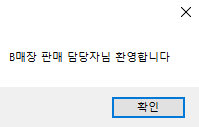
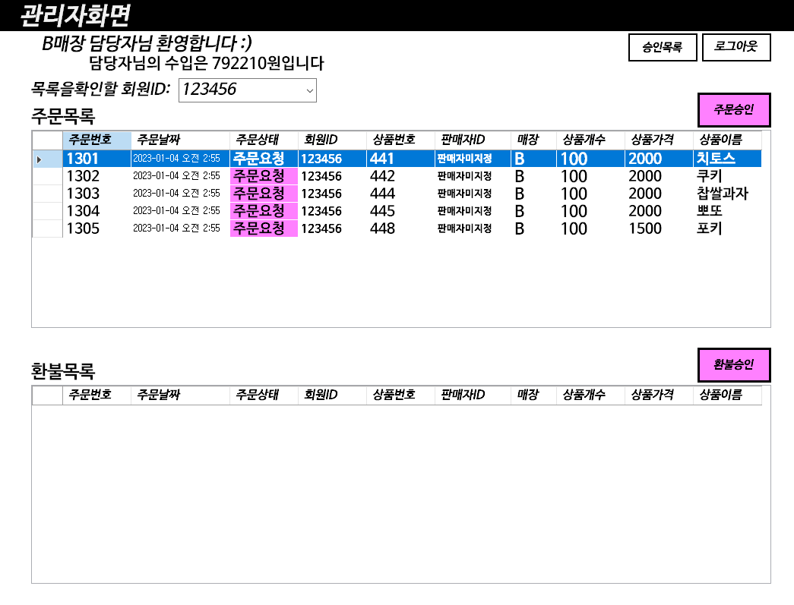
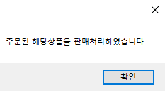

## 판매담당자로 로그인
radio를 판매자로 체크한 다음 로그인시도를하면 판매자화면으로  로그인 할 수있다.  
판매자는 각 매장마다 따로 구별되어있으며 각 a,b,c,d,e 매장의 판매자 아이디는 aa,bb,cc,dd,ee로 지정하고 비밀번호를 123으로 통일시켰다.  
전 내용에서 구입을 B매장에서 하였으니 그 부분을 확인하기 위해 B판매자화면으로 로그인하였다.   
 

각 매장의 담당자에 맞춰서 환영메세지를 띄우게끔 하였다  
 

로그인을 하면 다음과 같은 화면으로 들어오게 된다  
주문목록텍스트 밑의 그리드뷰는 주문승인해줘야할 주문들과, 주문승인을 완료한 주문들이 있으며 환불목록렉스트 밑의 그리드뷰는 환불승인을 해줘야할 주문들과 환불완료된 주문들을 띄우게 하였다

 

전에 내가 회원가입했었던 아이디 123456회원의 주문,환불목록만을 보고싶을 때는
'목록을확인할 회원ID' 텍스트 오른쪽 comboBox에 뜨는 회원 리스트들 중 선택하면 아래 그림처럼 확인할 수있다
 

주문요청된 상품 중 치토스 상품을 선택하고 주문승인 버튼을 누르면 아래처럼 메세지박스가 뜨고   
 

치토스의 주문상태가 주문요청에서 주문완료로 변경된 것을 확인할 수있다
 