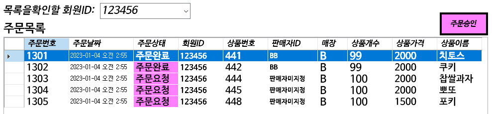

## 판매담당자로 로그인
radio를 판매자로 체크한 다음 로그인시도를하면 판매자화면으로  로그인 할 수있다.  
판매자는 각 매장마다 따로 구별되어있으며 각 a,b,c,d,e 매장의 판매자 아이디는 aa,bb,cc,dd,ee로 지정하고 비밀번호를 123으로 통일시켰다.  
전 내용에서 구입을 B매장에서 하였으니 그 부분을 확인하기 위해 B판매자화면으로 로그인하였다.   
 

각 매장의 담당자에 맞춰서 환영메세지를 띄우게끔 하였다  
 

로그인을 하면 다음과 같은 화면으로 들어오게 된다  
주문목록텍스트 밑의 그리드뷰는 주문승인해줘야할 주문들과, 주문승인을 완료한 주문들이 있으며 환불목록렉스트 밑의 그리드뷰는 환불승인을 해줘야할 주문들과 환불완료된 주문들을 띄우게 하였다

 
``` C#
        private void 판매자화면_Load(object sender, EventArgs e)
        {

            comboBox1.Items.Clear();

            회원TableAdapter1.Fill(dataSet11.회원);
            mytable1 = dataSet11.Tables["회원"];


            foreach (DataRow mydataRow in mytable1.Rows)
            {
                comboBox1.Items.Add(mydataRow["회원ID"]);
            }


            판매자label.Text = 판매자매장 + "매장 담당자님 환영합니다 :)";
            // TODO: 이 코드는 데이터를 'dataSet11.주문상태VIEW' 테이블에 로드합니다. 필요 시 이 코드를 이동하거나 제거할 수 있습니다.
            this.주문상태VIEWTableAdapter.Fill(this.dataSet11.주문상태VIEW);
            주문상태VIEWBindingSource.Filter = "매장ID= '" + 판매자매장 + "' AND (주문상태= '주문요청' OR 주문상태= '주문완료')";
            주문상태VIEWBindingSource1.Filter = "매장ID= '" + 판매자매장 + "' AND (주문상태= '환불요청' OR 주문상태= '환불완료')";

            //판매자 수입 갱신
            판매자TableAdapter1.Fill(dataSet11.판매자);
            mytable = dataSet11.Tables["판매자"];
            DataRow foundRows = mytable.Rows.Find(판매자ID);
            if (foundRows != null)
            {
                수입label.Text = "담당자님의 수입은 " + foundRows["수입"].ToString() + "원입니다";
            }


        }
```
전에 내가 회원가입했었던 아이디 123456회원의 주문,환불목록만을 보고싶을 때는
'목록을확인할 회원ID' 텍스트 오른쪽 comboBox에 뜨는 회원 리스트들 중 선택하면 아래 그림처럼 확인할 수있다
 

해당기능은 회원IDComboBox의 SelectedIndexChanged 이벤트 코드를 사용하였다
``` C#
        private void 회원검색(object sender, EventArgs e)
        {
          

            this.주문상태VIEWTableAdapter.Fill(this.dataSet11.주문상태VIEW);
            주문상태VIEWBindingSource.Filter = "회원ID='"+ comboBox1.SelectedItem.ToString() + "' AND 매장ID= '" + 판매자매장 + "' AND (주문상태= '주문요청' OR 주문상태= '주문완료')";
            주문상태VIEWBindingSource1.Filter = "회원ID='" + comboBox1.SelectedItem.ToString() + "' AND 매장ID= '" + 판매자매장 + "' AND (주문상태= '환불요청' OR 주문상태= '환불완료')";
                
        }
```

## 주문승인
주문요청된 상품 중 '치토스','쿠키' 상품을 선택하고 주문승인 버튼을 누르면 아래처럼 메세지박스가 뜨고   
 

'치토스','쿠키'의 주문상태가 주문요청에서 주문완료로 변경된 것을 확인할 수있다
 

```C#
        private void 주문승인button_Click(object sender, EventArgs e)
        {
            this.주문TableAdapter1.Fill(this.dataSet11.주문);

 
            if (dataGridView1.CurrentRow.Cells[2].Value.ToString()=="주문완료")
            {
                MessageBox.Show("이미 주문완료가 된 상품입니다");
            }
           else { 
                주문TableAdapter1.주문완료변경(dataGridView1.CurrentRow.Cells[0].Value.ToString());
                주문TableAdapter1.판매자이름작성(판매자ID, dataGridView1.CurrentRow.Cells[0].Value.ToString());
                주문TableAdapter1.판매날짜설정(DateTime.Now, dataGridView1.CurrentRow.Cells[0].Value.ToString());
                주문TableAdapter1.Update(dataSet11.주문);

                MessageBox.Show("주문된 해당상품을 판매처리하였습니다");

                //판매자수입갱신
                int 판매가격 = Convert.ToInt32(dataGridView1.CurrentRow.Cells[8].Value.ToString());
                판매자TableAdapter1.수입갱신(판매가격, 판매자ID);

                판매자TableAdapter1.Fill(dataSet11.판매자);
                mytable = dataSet11.Tables["판매자"];
                DataRow foundRows = mytable.Rows.Find(판매자ID);
                if (foundRows != null)
                {
                    수입label.Text = "담당자님의 수입은 " + foundRows["수입"].ToString() + "원입니다";
                }

                //상품량 줄이기
                상품TableAdapter1.구입후상품개수(dataGridView1.CurrentRow.Cells[4].Value.ToString());

            }

            this.주문상태VIEWTableAdapter.Fill(this.dataSet11.주문상태VIEW);
        }

```
## 환불승인
 

 

``` C#
       private void 환불승인button_Click(object sender, EventArgs e)
        {
            this.주문TableAdapter1.Fill(this.dataSet11.주문);


            if (dataGridView2.CurrentRow.Cells[2].Value.ToString() == "환불완료")
            {
                MessageBox.Show("이미 환불완료가 된 상품입니다");
            }
            else
            {

                MessageBox.Show("주문된 해당 상품을 환불처리하였습니다");

                주문TableAdapter1.환불완료변경(dataGridView2.CurrentRow.Cells[0].Value.ToString());

                주문TableAdapter1.Update(dataSet11.주문);

                //판매자 환불후 수입갱신
                int 반품가격 = Convert.ToInt32(dataGridView2.CurrentRow.Cells[8].Value.ToString());
                판매자TableAdapter1.환불수입갱신(반품가격,판매자ID);

                //상품재고 + 해야함 
                String val = dataGridView2.CurrentRow.Cells[4].Value.ToString();
                상품TableAdapter1.환불후상품개수(val);


                판매자TableAdapter1.Fill(dataSet11.판매자);
                mytable = dataSet11.Tables["판매자"];
                DataRow foundRows = mytable.Rows.Find(판매자ID);
                if (foundRows != null)
                {
                    수입label.Text = "담당자님의 수입은 " + foundRows["수입"].ToString() + "원입니다";
                }

                //구매자 구매액 빼기

                int 가격 = Convert.ToInt32(dataGridView2.CurrentRow.Cells[8].Value.ToString()); ;
                회원TableAdapter1.회원환불액(가격, dataGridView2.CurrentRow.Cells[3].Value.ToString()).ToString();

               
            }

            this.주문상태VIEWTableAdapter.Fill(this.dataSet11.주문상태VIEW);
        }

```

## 승인목록
 