### ```오프라인 회원제 공산품 마트 데이터베이스 및 응용 프로그램 구현하기 ``` 

## 로그인 후 회원메인 화면
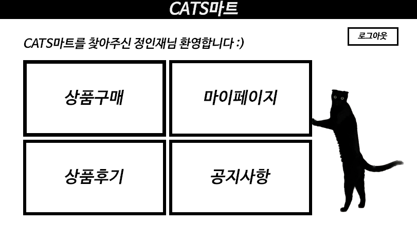  
회원이 로그인을 하고 할 수있는 기능들을 네가지로 나누어 버튼을 만들고 해당 버튼을 클릭할 시 각각의 서비스를 사용할 수 있도록 하였다

## 회원 구입선택 화면
메인화면에서 상품구매 버튼을 눌렀을 때의 UI이다 
우선 DB 설계와 시작에서 명시해놓았던 요구사항과 기능에 맞춰서 5가지의 매장 중 어느 매장에서 구입을 할지, 어떤 상품종류를 구입을 할지 선택하면 해당 매장에서 판매하는 모든 상품들이 상품상세의 데이터그리드뷰에 모두 표시되도록 하였다 
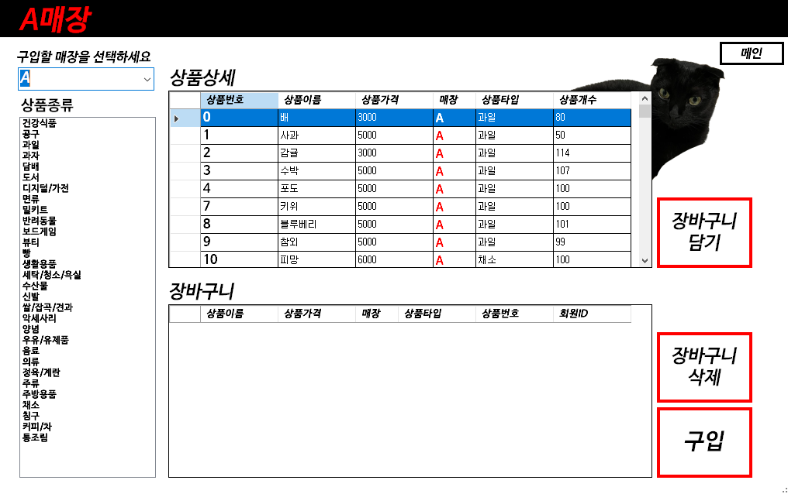  

매장comboBox의 속성에서 items를 이용하여 A,B,C,D,E를 입력하여 매장 콤보박스를 누를 때 5개의 매장 알파벳이 뜨도록 하였다   
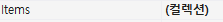  

"구입할 매장을 선택하세요"밑의 매장comboBox를 누르면 5개의 매장이 아래와 같이뜬다  
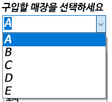  

아래코드는 구입선택 폼을 열시 초기 설정 코드이다
```C#
        private void 구입매장선택_Load(object sender, EventArgs e)
        {
            // TODO: 이 코드는 데이터를 'dataSet11.장바구니상품VIEW' 테이블에 로드합니다. 필요 시 이 코드를 이동하거나 제거할 수 있습니다
            comboBox1.SelectedIndex = 0; //폼을 열 시 첫번째 매장(A)이 선택되어 있는 상태로 접속
            
            this.장바구니상품VIEWTableAdapter.Fill(this.dataSet11.장바구니상품VIEW);
            this.상품TableAdapter1.Fill(this.dataSet11.상품);
            상품타입listBox.Items.Clear();

            상품타입TableAdapter1.Fill(dataSet11.상품타입);
            mytable = dataSet11.Tables["상품타입"];

            foreach (DataRow mydataRow in mytable.Rows)
            {
                상품타입listBox.Items.Add(mydataRow["상품타입"]);
            } //상품타입 리스트 박스에 매장의 상품타입을 나열
        }
```


그 중 B매장을 선택하면 해당 매장에서 판매하는 모든 상품들이 상품상세 밑 그리드뷰에 모두 표시되며 상품종류 밑 리스트박스에 과자버튼을 누르면 해당 매장의 과자상품들만 아래처럼 표시된다 
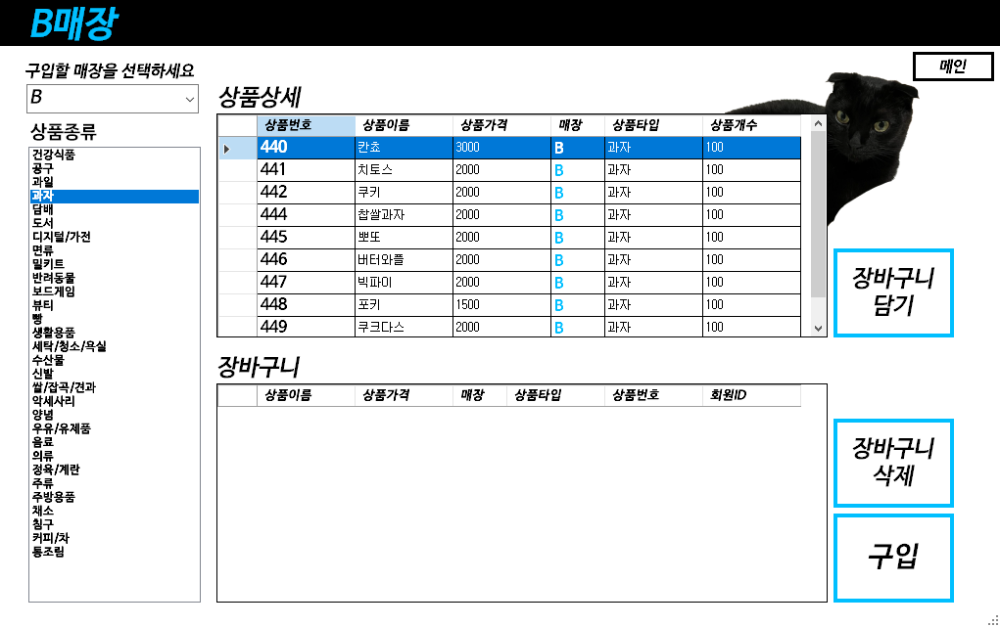

선택한대로 그리드 뷰의 내용을 바뀌게 하기 위해서 매장선택 ComboBox와 상폼종류선택 listBox의 속성에서 SelectedIndexChanged 이벤트가 필요했다  
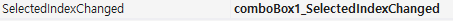  


매장ComboBox의 SelectedIndexChanged 이벤트 코드이다
``` C#
   private void comboBox1_SelectedIndexChanged(object sender, EventArgs e) //매장선택 ComboBox의 change이벤트
        {
            상품타입TableAdapter1.Fill(dataSet11.상품타입);
            mytable = dataSet11.Tables["상품타입"];

            상품TableAdapter1.Fill(dataSet11.상품);
            mytable2 = dataSet11.Tables["상품"];
            
            //중간에 디자인(Color)와 관련한 내용은 'UI 디자인'에 있으니 생략
            if (comboBox1.SelectedIndex == 0)
            {
                매장.Text = "A매장";
                상품BindingSource.Filter = "매장ID= 'A'";
                장바구니상품VIEWBindingSource.Filter = "회원ID= '" + loginid + "' AND 매장ID= 'A'";
            }
            else if (comboBox1.SelectedIndex == 1)
            {
                매장.Text = "B매장";
                상품BindingSource.Filter = "매장ID= 'B'";
                장바구니상품VIEWBindingSource.Filter = "회원ID= '" + loginid + "' AND 매장ID= 'B'";
            }
            else if (comboBox1.SelectedIndex == 2)
            {
                매장.Text = "C매장";
                상품BindingSource.Filter = "매장ID= 'C'";
                장바구니상품VIEWBindingSource.Filter = "회원ID= '" + loginid + "' AND 매장ID= 'C'";
            }
            else if (comboBox1.SelectedIndex == 3)
            {
                매장.Text = "D매장";
                상품BindingSource.Filter = "매장ID= 'D'";
                장바구니상품VIEWBindingSource.Filter = "회원ID= '" + loginid + "' AND 매장ID= 'D'";
            }
            else
            {
                매장.Text = "E매장";
                상품BindingSource.Filter = "매장ID= 'E'";
                장바구니상품VIEWBindingSource.Filter = "회원ID= '" + loginid + "' AND 매장ID= 'E'";
            }
        }
```
상품종류listBox의 SelectedIndexChanged 이벤트 코드이다
``` C#
        private void 상품종류listBox_SelectedIndexChanged(object sender, EventArgs e)
        {
            상품TableAdapter1.Fill(dataSet11.상품);
            mytable = dataSet11.Tables["상품"];

            상품타입TableAdapter1.Fill(dataSet11.상품타입);
            mytable2 = dataSet11.Tables["상품타입"];

            상품BindingSource.Filter = "상품타입= '" + 상품타입listBox.SelectedItem + "' AND 매장ID= '" + comboBox1.SelectedItem + "'";
        }
```
### 장바구니 담을시
상품상세텍스트 아래 리스트뷰에 나열되어 있는 상품들을 클릭하고 장바구니담기 버튼을 누르면 장바구니텍스트 아래 리스트뷰에 하나씩 담기게 된다.

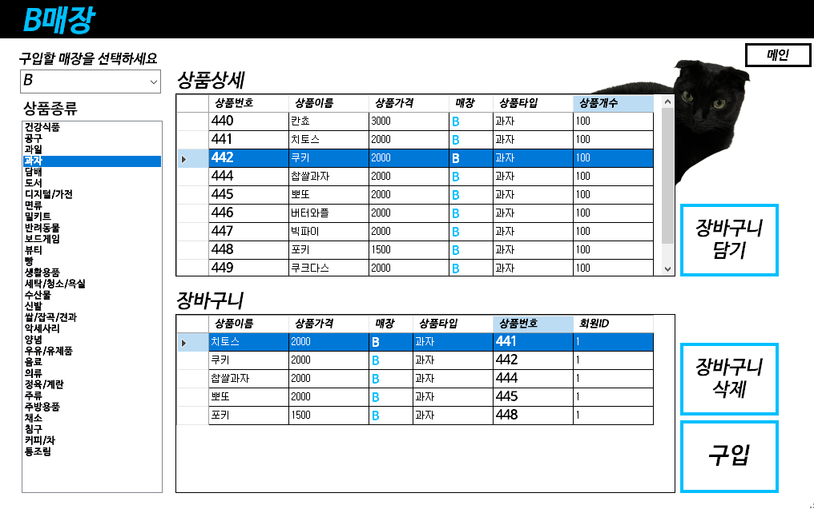
``` C#
 private void button3_Click(object sender, EventArgs e) //장바구니 담기 버튼 클릭시
        {
            장바구니TableAdapter.Fill(dataSet11.장바구니);
            mytable = dataSet11.Tables["장바구니"];
            DataRow mynewDataRow = mytable.NewRow();

            Int32 selectedCellCount = dataGridView1.GetCellCount(DataGridViewElementStates.Selected);
            try
            {
                if (selectedCellCount > 0)
                {
                    mynewDataRow["상품번호"] = dataGridView1.CurrentRow.Cells[0].Value.ToString();
                    mynewDataRow["회원ID"] = loginid; //로그인 폼에서 전역으로 가져온 회원아이디
                    
                    if (상품TableAdapter1.품절찾기() == dataGridView1.CurrentRow.Cells[0].Value.ToString()) {
                        MessageBox.Show("해당 상품은 품절입니다");
                        return;
                    }
                    else
                    {
                        mytable.Rows.Add(mynewDataRow);
                        
                    }
                }
                else
                {
                    MessageBox.Show("장바구니에 담을 상품을 선택하세요");
                }
            }
            catch (System.Exception ex)
            {
                MessageBox.Show("이미 장바구니에 담은 상품입니다");
            }     
                //this.장바구니상품VIEWBindingSource.EndEdit();
                int numOfRows = 장바구니TableAdapter.Update(dataSet11.장바구니);
                if (numOfRows > 0)
                {
                    this.장바구니상품VIEWTableAdapter.Fill(this.dataSet11.장바구니상품VIEW);
                    장바구니상품VIEWBindingSource.Filter = "회원ID= '" + loginid + "' AND 매장ID= '"+ comboBox1.SelectedItem + "'";
            }

   
        }
```

### 장바구니 삭제 시
장바구니텍스트 아래 리스트뷰에 상품을 선택하고 장바구니 삭제를 누르면 해당 상품이 장바구니리스트뷰에서 제외된다.

``` C#
        private void button4_Click(object sender, EventArgs e) //장바구니 삭제 버튼
        {
            int 장바구니행개수 = dataGridView2.Rows.Count;
            if (장바구니행개수 <= 0) //장바구니가 비워있는 상태에서 장바구니 삭제버튼을 눌렀을 경우
            {
                MessageBox.Show("장바구니에 삭제할 상품이 없습니다");

            }
            else
            {
                DataGridViewRow data = dataGridView2.SelectedRows[0];


                string val = data.Cells[4].Value.ToString();
                장바구니TableAdapter.DeleteQuery(val);

                this.장바구니상품VIEWTableAdapter.Fill(this.dataSet11.장바구니상품VIEW);
                장바구니상품VIEWBindingSource.Filter = "회원ID= '" + loginid + "' AND 매장ID= '"+comboBox1.SelectedItem+"'";
            }
        }
            
```

### 구입할 시
장바구니리스트뷰에 5가지이상의 상품이 담긴 상태에서 구입버튼을 누르면 해당 장바구니리스트뷰에 담겨있는 모든 상품들이 구입되며 총 상품의 가격들이 더해져 구매액을 아래처럼 계산하여 알려준다.  
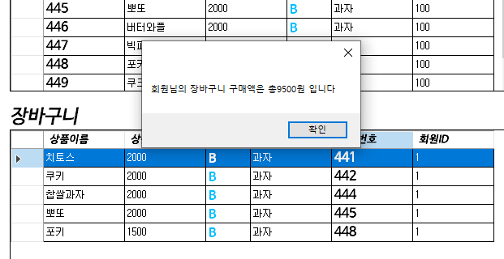
``` C#
        private void button5_Click(object sender, EventArgs e) //구입 버튼
        {
            int 장바구니행개수 = dataGridView2.Rows.Count;
            int 가격 = 0;

            if (장바구니행개수 >= 5)
            {  
                상품TableAdapter1.Fill(dataSet11.상품);
                mytable = dataSet11.Tables["상품"];

                //장바구니에 있는 상품을 주문에 넣는 코드
                주문TableAdapter1.Fill(dataSet11.주문);
                mytable2 = dataSet11.Tables["주문"];

                for (int a = 0; a < 장바구니행개수; a++)
                {
                    DataGridViewRow data = dataGridView2.Rows[a];
                    string val = data.Cells[4].Value.ToString();

                    String s = 주문TableAdapter1.시퀀스().ToString();
                    DataRow newDataRow = mytable2.NewRow();
                    newDataRow["주문번호"] = s;
                    newDataRow["주문날짜"] = DateTime.Now.ToString();
                    newDataRow["후기작성여부"] = "후기없음";
                    newDataRow["주문상태"] = "주문요청";
                    newDataRow["회원ID"] = loginid;
                    newDataRow["상품번호"] = val;
                    newDataRow["판매담당자ID"] = "판매자미지정";
                    newDataRow["매장ID"] = comboBox1.SelectedItem;
                    mytable2.Rows.Add(newDataRow);

                        주문TableAdapter1.Update(dataSet11.주문);


                    //총구입액 더하기 (장바구니 구매액)
                    가격 += Convert.ToInt32(data.Cells[1].Value.ToString());;
                }
                회원TableAdapter1.회원구매액(가격, loginid).ToString();
                MessageBox.Show("회원님의 장바구니 구매액은 총" + 가격.ToString() + "원 입니다");

                //구입 후 장바구니를 비우는 코드
                for (int b = 0; b < 장바구니행개수; b++)
                {
                    DataGridViewRow data2 = dataGridView2.Rows[b];
                    string val2 = data2.Cells[4].Value.ToString();
                    장바구니TableAdapter.DeleteQuery(val2);
                }

                this.장바구니상품VIEWTableAdapter.Fill(this.dataSet11.장바구니상품VIEW);
                장바구니상품VIEWBindingSource.Filter = "회원ID= '" + loginid + "' AND 매장ID= '"+comboBox1.SelectedItem+"'";
            }
            else if(장바구니행개수 == 0) //장바구니에 아무 것도 없을 경우
            {
                MessageBox.Show("구입할 상품을 장바구니에 담아주세요.");
            }
            else //장바구니에 5개 이하의 
            {
                MessageBox.Show("장바구니에 5개이상의 상품을 담아야 구입이 가능합니다.");
            }
        }
```

** 단, ``설계와 시작``에 명시되어있는 <기능>에서 '1번 구매에 5개 종류 이상의 상품을 구매'라는 항목에 따라 4개 이하의 상품이 장바구니에 담겨있는 상태에서 구입버튼을 누르면 구입되지 않도록하였다
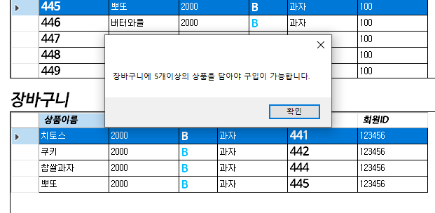 

## 마이페이지 화면
고객들의 구매내역의 상세정보들과 환불요청, 고객의 등급과 탈퇴까지의 기능들을 담고있는 창이다.
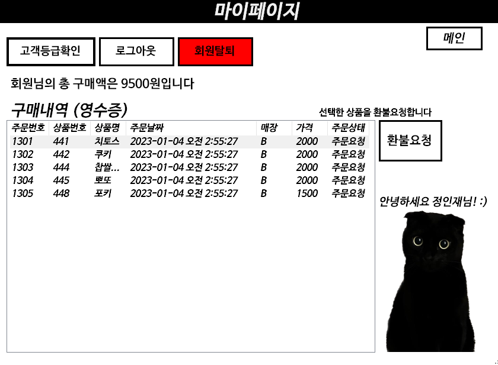

아래코드는 마이페이지 폼을 열시 초기 설정 코드이다
``` C#
       private void 마이페이지_Load(object sender, EventArgs e)
        {
            회원TableAdapter1.Fill(dataSet11.회원);
            mytable2 = dataSet11.Tables["회원"];

            DataRow dataRow2 = mytable2.Rows.Find(loginid);
            회원label.Text = "안녕하세요 " + dataRow2["회원이름"].ToString() + "님! :)";
            구매label.Text = "회원님의 총 구매액은 " + dataRow2["총구매액"].ToString() + "원입니다";

            주문상태VIEWTableAdapter1.Fill(dataSet11.주문상태VIEW);
            mytable = dataSet11.Tables["주문상태VIEW"];


            foreach (DataRow dataRow in mytable.Rows )
            {
                if (dataRow["회원ID"].ToString() == loginid)
                {
                    ListViewItem lvi1 = new ListViewItem(dataRow["주문번호"].ToString());
                    lvi1.SubItems.Add(dataRow["상품번호"].ToString());
                    lvi1.SubItems.Add(dataRow["상품이름"].ToString());
                    lvi1.SubItems.Add(dataRow["주문날짜"].ToString());
                    lvi1.SubItems.Add(dataRow["매장ID"].ToString());
                    lvi1.SubItems.Add(dataRow["상품가격"].ToString());
                    lvi1.SubItems.Add(dataRow["주문상태"].ToString());
                    listView1.Items.Add(lvi1);
                }

            }

            try { 
                this.listView1.Items[0].Focused = true;
                this.listView1.Items[0].Selected = true;
                }
            catch(System.Exception ex)
            {

            }
        }
```
### 환불요청 선택시
환불에 관하여서 많은 고민을 하였다
우선 상품의 주문상태를 '주문요청' '주문완료' '환불요청' '환불완료' 로 총 4개의 타입을 만들었다  
- **주문요청**  
고객이 상품을 구매하기 직후의 상태
- **주문완료**  
고객이 상품을 구매하고 판매담당자가 주문완료처리를한 상태
- **환불요청**  
고객이 주문완료 상태인 상품을 환불요청한 상태
- **환불완료**  
환불요청된 상품을 판매담당자가 환불완료처리를한 상태 


주문완료상태에서는 판매자가 주문을 승인하고 완료된 상태이기 때문에 환불요청을 하면 주문상태가 환불요청으로 바뀌게 된다  
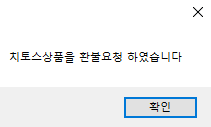  
주문요청상태에서는 주문이 완벽히 완료된 것이 아니기 때문에 주문요청상태인 상품을 환불요청을 하면 주문이 취소되며 아래의 메세지가 표시된다  
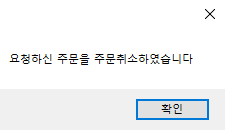  
주문요청상태는 판매자가 주문을 승인하기 전이기 때문에 주문이 취소되면 상품의 주문상태가 변하는 것이 아닌 아예 그 주문이 없었던 것으로 처리된다  
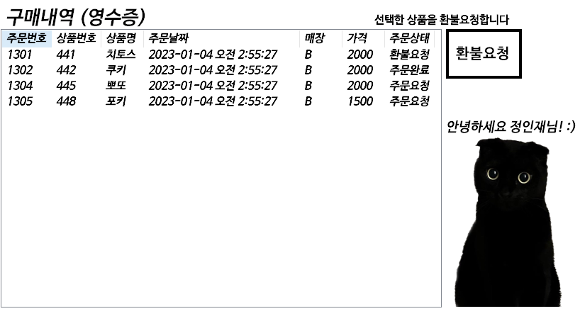

### 고객등급확인 선택시
고객등급은 뒤에 나올 관리자화면에서 관리자가 고객들의 구매,환불 수를 보고 지정할 수 있으며, 따로 지정하지 않은 신규회원의 등급은 일반회원이다 
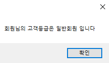
``` C#
        private void button4_Click(object sender, EventArgs e)
        {
            회원TableAdapter1.Fill(dataSet11.회원);
            mytable = dataSet11.Tables["회원"];
            DataRow myDataRow = mytable.Rows.Find(loginid);
            MessageBox.Show("회원님의 고객등급은 "+ myDataRow["회원타입"].ToString()+ " 입니다");
        }
```

### 회원탈퇴 선택시  
로그아웃이 아닌 회원탈퇴를 누르면 회원의 모든 아이디, 비밀번호, 이름 등의 정보들이 삭제되기 때문에 UI버튼을 빨갛게 해두고 누를때 바로 탈퇴처리가 되는 것이 아닌 확인 메세지를 한번 더 물어 예(Y)를 눌렀을 때 탈퇴처리를 하고 로그인 창으로 돌려보내도록 하였다  
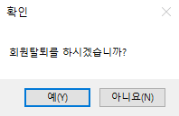
``` C#
        private void button3_Click(object sender, EventArgs e)
        {
            
            회원TableAdapter1.Fill(dataSet11.회원);
            mytable = dataSet11.Tables["회원"];
            DataRow myDataRow = mytable.Rows.Find(loginid);

            try
            {
                if (MessageBox.Show("회원탈퇴를 하시겠습니까?", "확인", MessageBoxButtons.YesNo) == DialogResult.Yes)
                {
                    if (myDataRow != null)
                    {

                        주문TableAdapter1.회원탈퇴주문(loginid);
                        후기TableAdapter1.회원탈퇴후기(loginid);
                        장바구니TableAdapter1.회원탈퇴장바구니(loginid);
                        myDataRow.Delete();
                        회원TableAdapter1.Update(dataSet11.회원);
                        MessageBox.Show("회원탈퇴 되었습니다");

                        this.Visible = false;
                        로그인 showForm2 = new 로그인();
                        showForm2.ShowDialog();     // show를 showDialog로 바꿔줌


                    }
                    //확인시 내용
                    MessageBox.Show("회원탈퇴 되었습니다");
                }
              
            }catch(Oracle.ManagedDataAccess.Client.OracleException)
            {
                MessageBox.Show("현재 처리되지 않은 주문이나 장바구니에 담겨있는 상품이 있습니다.");
            }


        }
```