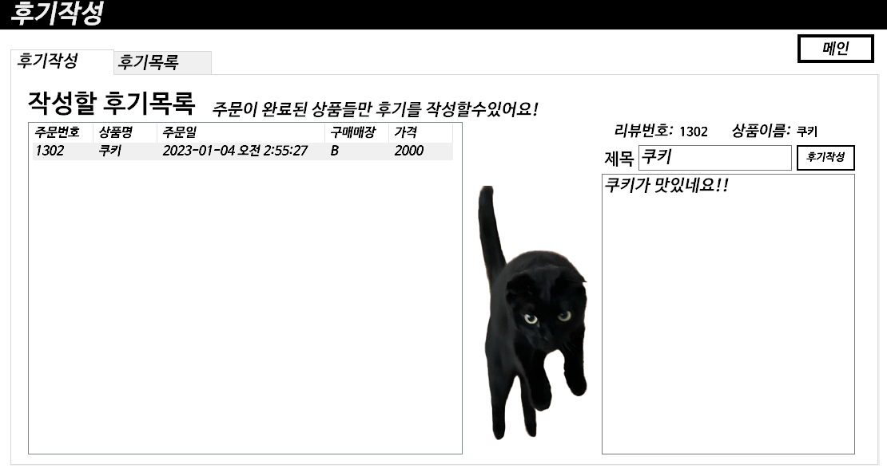

## 공지사항
관리자가 작성한 공지사항들을 확인할 수있다 각 매장마다 어떤 공지를 썻는지 매장 comboBox로 구별하여 확인 할 수있고, 공지타입을 (사진 속 상품타입은 오타 공지타입임) 일반공지, 가격변동, 상품입고 세가지로 나누어 관리자가 타입에 맞게 작성하고 회원 역시 구별하여 확인할 수있다


회원공지 폼을 열 때 초기코드
``` C#
        private void 회원공지_Load(object sender, EventArgs e)
        {

            
            공지사항TableAdapter1.Fill(dataSet11.공지사항);
            mytable = dataSet11.Tables["공지사항"];


            foreach (DataRow dataRow in mytable.Rows)
            {

                ListViewItem lvi1 = new ListViewItem(dataRow["공지날짜"].ToString());
                lvi1.SubItems.Add(dataRow["제목"].ToString());
                lvi1.SubItems.Add(dataRow["공지타입"].ToString());
                lvi1.SubItems.Add(dataRow["매장ID"].ToString());
                listView1.Items.Add(lvi1);

            }
            
        }
```

매장 ComboBox의 SelectedIndexChanged 이벤트 코드이다
``` C#
        private void 매장변경(object sender, EventArgs e)
        {
            listView1.Items.Clear();
            comboBox2.Text = string.Empty;
            공지사항TableAdapter1.Fill(dataSet11.공지사항);
            mytable = dataSet11.Tables["공지사항"];


            foreach (DataRow dataRow in mytable.Rows)
            {
                if (dataRow["매장ID"].ToString() == comboBox1.SelectedItem.ToString() && mytable != null)
                {
                    ListViewItem lvi1 = new ListViewItem(dataRow["공지날짜"].ToString());
                    lvi1.SubItems.Add(dataRow["제목"].ToString());
                    lvi1.SubItems.Add(dataRow["공지타입"].ToString());
                    lvi1.SubItems.Add(dataRow["매장ID"].ToString());
                    listView1.Items.Add(lvi1);
                }

            }
        }

```


공지타입 ComboBox의 SelectedIndexChanged 이벤트 코드이다
``` C#
        private void 공지타입변경(object sender, EventArgs e)
        {
            listView1.Items.Clear();
            공지사항TableAdapter1.Fill(dataSet11.공지사항);
            mytable = dataSet11.Tables["공지사항"];


            foreach (DataRow dataRow in mytable.Rows)
            {
            
                    if (dataRow["매장ID"].ToString() == comboBox1.SelectedItem.ToString() && dataRow["공지타입"].ToString() == comboBox2.SelectedItem.ToString() && mytable != null)
                    {
                        ListViewItem lvi1 = new ListViewItem(dataRow["공지날짜"].ToString());
                        lvi1.SubItems.Add(dataRow["제목"].ToString());
                        lvi1.SubItems.Add(dataRow["공지타입"].ToString());
                        lvi1.SubItems.Add(dataRow["매장ID"].ToString());
                        listView1.Items.Add(lvi1);
                    }
       
            }
        }
```

공지목록 그리드뷰의 SelectedIndexChanged 이벤트 코드이다

``` C#
        private void 공지선택(object sender, EventArgs e)
        {
            if (listView1.SelectedItems.Count > 0)
            {
                int SelectRow = listView1.SelectedItems[0].Index;
                string 제목 = listView1.Items[SelectRow].SubItems[1].Text;
                string 매장 = listView1.Items[SelectRow].SubItems[3].Text;
                string 공지타입 = listView1.Items[SelectRow].SubItems[2].Text;
                string 공지날짜 = listView1.Items[SelectRow].SubItems[0].Text;

                공지사항TableAdapter1.Fill(dataSet11.공지사항);
                mytable = dataSet11.Tables["공지사항"];
                DataRow[] foundRows = mytable.Select("제목 ='" + 제목 + "' AND 공지타입 ='" + 공지타입 + "' AND 매장ID ='" + 매장 + "' AND 공지날짜 ='" + 공지날짜 + "'");


                foreach (DataRow mydata in foundRows)
                {
                    textBox1.Text = mydata["내용"].ToString();
                }
            }
        }
```


## 후기작성
탭박스를 이융하여 자신이 산 상품을 작성할 수있는 '후기작성'탭과 다른 회원들이 남긴 후기들을 볼 수있는 '후기목록'탭으로 구성하였다
``` C#

        private void 후기작성_Load(object sender, EventArgs e)
        {


            // TODO: 이 코드는 데이터를 'dataSet11.후기VIEW' 테이블에 로드합니다. 필요 시 이 코드를 이동하거나 제거할 수 있습니다.
            this.후기VIEWTableAdapter.Fill(this.dataSet11.후기VIEW);


            주문상태VIEWTableAdapter1.Fill(dataSet11.주문상태VIEW);
            mytable = dataSet11.Tables["주문상태VIEW"];


            foreach (DataRow dataRow in mytable.Rows)
            {
                if (dataRow["회원ID"].ToString() == loginid && dataRow["상품번호"].ToString() == dataRow["상품번호"].ToString() && mytable != null && dataRow["후기작성여부"].ToString() == "후기없음" && dataRow["주문상태"].ToString() == "주문완료")
                {
                    ListViewItem lvi1 = new ListViewItem(dataRow["주문번호"].ToString());
                    lvi1.SubItems.Add(dataRow["상품이름"].ToString());
                    lvi1.SubItems.Add(dataRow["주문날짜"].ToString());
                    lvi1.SubItems.Add(dataRow["매장ID"].ToString());
                    lvi1.SubItems.Add(dataRow["상품가격"].ToString());
                    listView1.Items.Add(lvi1);
                }
            }

            try
            {
                this.listView1.Items[0].Focused = true;
                this.listView1.Items[0].Selected = true;
            }
            catch (System.Exception ex)
            {

            }
          
        }
```


### 후기를 작성할 때
후기작성탭에서 후기를 작성할 수있다  
작성할 후기목록 택스트 밑 그리드뷰에는 주문상태가 '주문완료'인 상품들만 뜨도록 하였다  
주문요청 상태인 상품은 판매자가 주문승인도 하기 전이기에 아직 상품을 수령하기 전이고, 환불요청과 환불완료된 상품은 후기를 적을필요가 없기 때문이다

!! 후기작성여부 라는 쿼리를 사용하였음 !!

 

후기작성버튼을 누를 때 코드
``` C# 
        private void 작성button_Click(object sender, EventArgs e)
        {

            int SelectRow = listView1.SelectedItems[0].Index;

            후기TableAdapter1.Fill(dataSet11.후기);
            mytable = dataSet11.Tables["후기"];
            DataRow mynewDataRow = mytable.NewRow();

            if (후기제목textBox.Text == string.Empty)
            {
                MessageBox.Show("후기 제목을 입력하세요");
                return;
            }
            else if (후기내용textBox.Text == string.Empty)
            {
                MessageBox.Show("후기 내용을 입력하세요");
                return;
            }
            else
            {

                string 주문번호 = listView1.Items[SelectRow].SubItems[0].Text;
                mynewDataRow["리뷰번호"] = 주문번호;
                mynewDataRow["리뷰제목"] = 후기제목textBox.Text;
                mynewDataRow["리뷰내용"] = 후기내용textBox.Text;
                mynewDataRow["회원ID"] = loginid;
                mynewDataRow["주문번호"] = 주문번호;
                mynewDataRow["리뷰날짜"] = DateTime.Now.ToString();

                try
                {
                    mytable.Rows.Add(mynewDataRow);
                    MessageBox.Show("후기 작성 완료");
                    후기제목textBox.Text = string.Empty;
                    후기내용textBox.Text = string.Empty;
                    주문TableAdapter1.후기작성여부(주문번호);


                    this.후기TableAdapter1.Update(this.dataSet11.후기);
                    this.후기VIEWTableAdapter.Fill(this.dataSet11.후기VIEW);


                    주문상태VIEWTableAdapter1.Fill(dataSet11.주문상태VIEW);
                    mytable = dataSet11.Tables["주문상태VIEW"];

                    listView1.Items.Clear();
                    foreach (DataRow dataRow in mytable.Rows)
                    {
                        if (dataRow["회원ID"].ToString() == loginid && dataRow["상품번호"].ToString() == dataRow["상품번호"].ToString() && mytable != null && dataRow["후기작성여부"].ToString() == "후기없음" && dataRow["주문상태"].ToString() == "주문완료")
                        {
                            ListViewItem lvi1 = new ListViewItem(dataRow["주문번호"].ToString());
                            lvi1.SubItems.Add(dataRow["상품이름"].ToString());
                            lvi1.SubItems.Add(dataRow["주문날짜"].ToString());
                            lvi1.SubItems.Add(dataRow["매장ID"].ToString());
                            lvi1.SubItems.Add(dataRow["상품가격"].ToString());
                            listView1.Items.Add(lvi1);
                        }
                    }

                    try
                    {
                        this.listView1.Items[0].Focused = true;
                        this.listView1.Items[0].Selected = true;
                    }
                    catch (System.Exception ex)
                    {

                    }

                }
                catch (System.Exception ex)
                {
                    MessageBox.Show("이미 후기를 작성한 상품입니다");
                    후기제목textBox.Text = string.Empty;
                    후기내용textBox.Text = string.Empty;
                }
            }


    
            }

```
작성할 후기 목록 그리드뷰의 SelectedIndexChanged 이벤트 코드이다
``` C#
        private void 목록(object sender, EventArgs e)
        {
            if (listView1.SelectedItems.Count > 0)
            {
                int SelectRow = listView1.SelectedItems[0].Index;
                string 주문번호 = listView1.Items[SelectRow].SubItems[0].Text;
                string 상품이름 = listView1.Items[SelectRow].SubItems[1].Text;

                리뷰번호label.Text = 주문번호;
                상품이름label.Text = 상품이름;
            }
        }
```

그리드뷰에 작성할 후기를 선택하고 제목과 내용을 작성한다음 후기작성버튼을 누르면 후기가 작성된며 아래처럼 메세지박스가 뜨게하였다  
 

### 작성된 후기들을 확인할 때
후기목록탭에서는 다른 모든 회원들이 작성한 후기목록들을 확인할 수있다
그리드뷰를 선택하면 옆에 제목과 내용들이 바껴 확인할 수있다


작성한 후기 목록 그리드뷰의 SelectedIndexChanged 이벤트 코드이다
``` C# 
        private void 후기목록클릭(object sender, DataGridViewCellEventArgs e)
        {
            string val = dataGridView1.CurrentRow.Cells[0].Value.ToString();

            후기TableAdapter1.Fill(dataSet11.후기);
            mytable = dataSet11.Tables["후기"];

            DataRow foundRows = mytable.Rows.Find(val);

            if (foundRows != null)
            {
                후기내용2textBox.Text = foundRows["리뷰내용"].ToString();
                제목내용label.Text = foundRows["리뷰제목"].ToString();
            }
        }
```

추가적으로 특정상품의 후기들만 보고 싶을수있기에 상품명으로 필터를 걸어 볼 수있도록 하였다 아래처럼 '쿠키'를 입력하고 검색버튼을 누르면 '쿠키'의 후기들만 볼 수있으며 버튼텍스트가 검색에서 검색해제로 바뀌게된다  
검색해제를 누르면 다시 모든 후기들이 보여지게 된다


검색버튼을 누를 때 코드
``` C#
        private void 검색button_Click(object sender, EventArgs e)
        {
            if (후기VIEWBindingSource.Filter != null)
            {
                후기VIEWBindingSource.RemoveFilter();
                검색button.Text = "검색";
            }
            else
            {
                후기VIEWBindingSource.Filter = "상품이름= '" + 검색textBox.Text + "'";
                검색button.Text = "검색해제";
            }
        }
```
